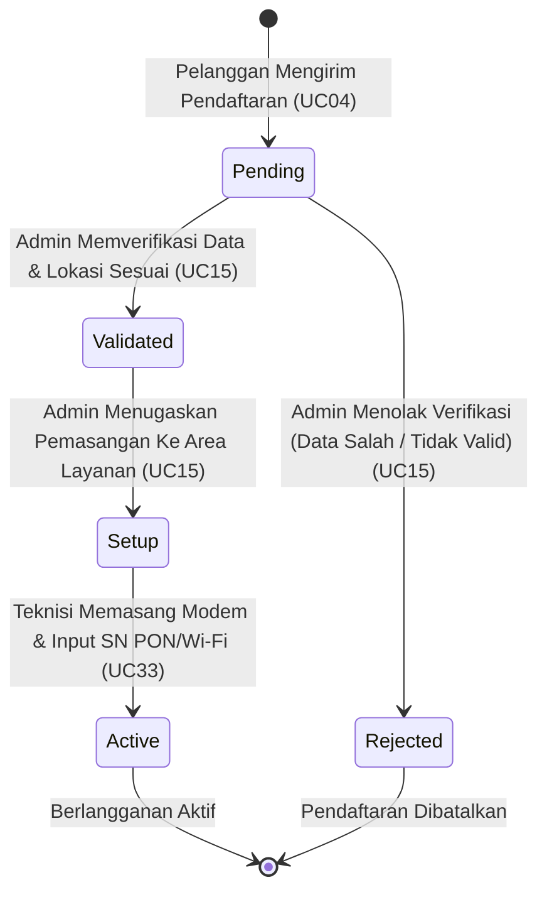
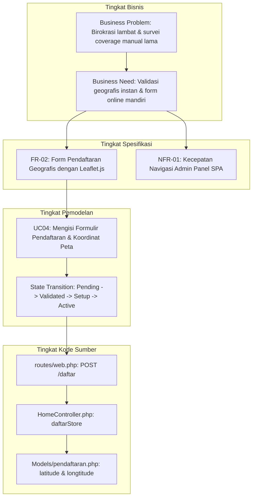

# ARTEFAK UAS APPL - ROLE 1: REQUIREMENTS ENGINEER

**SISTEM PENDAFTARAN LAYANAN INTERNET PROVIDER R-NET BERBASIS SINGLE-PAGE APPLICATION (SPA)**

---

## 👥 Profil Mahasiswa
*   **Nama Mahasiswa**  : [Nama Mahasiswa]
*   **NIM**             : [NIM Mahasiswa]
*   **Kelas / Semester**: D4 TRPL 2B / Semester 4
*   **Peran Utama**     : **Role 1 - Requirements Engineer**
*   **Kasus Proyek**    : Proyek Pengembangan Sistem R-NET (PBL Kelompok)

---

## 🏛️ DAFTAR ISI
1.  [1. BUSINESS UNDERSTANDING (Pemahaman Bisnis)](#1-business-understanding-pemahaman-bisnis)
    *   1.1 [Business Domain (Domain Bisnis)](#11-business-domain-domain-bisnis)
    *   1.2 [Business Problem (Masalah Bisnis)](#12-business-problem-masalah-bisnis)
    *   1.3 [Business Need (Kebutuhan Bisnis)](#13-business-need-kebutuhan-bisnis)
    *   1.4 [Business Value (Nilai Bisnis)](#14-business-value-nilai-bisnis)
    *   1.5 [Stakeholder Terlibat (Pemangku Kepentingan)](#15-stakeholder-terlibat-pemangku-kepentingan)
    *   1.6 [System Scope (Ruang Lingkup Sistem)](#16-system-scope-ruang-lingkup-sistem)
2.  [2. REQUIREMENTS ELICITATION (Elisitasi Kebutuhan)](#2-requirements-elicitation-elisitasi-kebutuhan)
    *   2.1 [Teknik Elisitasi yang Digunakan](#21-teknik-elisitasi-yang-digunakan)
    *   2.2 [Alasan Pemilihan Teknik](#22-alasan-pemilihan-teknik)
    *   2.3 [Hasil Elisitasi Kebutuhan](#23-hasil-elisitasi-kebutuhan)
3.  [3. REQUIREMENTS ANALYSIS & MODELLING (Analisis & Pemodelan Kebutuhan)](#3-requirements-analysis--modelling-analisis--pemodelan-kebutuhan)
    *   3.1 [Pemodelan Use Case (Use Case Diagram)](#31-pemodelan-use-case-use-case-diagram)
    *   3.2 [Pemodelan Transisi Status (State Transition Diagram)](#32-pemodelan-transisi-status-state-transition-diagram)
    *   3.3 [Peran Model dalam Memahami Kebutuhan Sistem](#33-peran-model-dalam-memahami-kebutuhan-sistem)
4.  [4. REQUIREMENTS SPECIFICATION & VALIDATION (Spesifikasi & Validasi Kebutuhan)](#4-requirements-specification--validation-spesifikasi--validasi-kebutuhan)
    *   4.1 [Daftar Kebutuhan Fungsional (Functional Requirements)](#41-daftar-kebutuhan-fungsional-functional-requirements)
    *   4.2 [Daftar Kebutuhan Non-Fungsional (Non-functional Requirements)](#42-daftar-kebutuhan-non-fungsional-non-functional-requirements)
    *   4.3 [Metode Validasi Kebutuhan Perangkat Lunak](#43-metode-validasi-kebutuhan-perangkat-lunak)
5.  [5. ARTEFAK & ALUR KETERLACAKAN (Traceability)](#5-artefak--alur-keterlacakan-traceability)
    *   5.1 [Hubungan Alur Rantai Artefak (Business Problem ke Requirement Models)](#51-hubungan-alur-rantai-artefak-business-problem-ke-requirement-models)

---

## 1. BUSINESS UNDERSTANDING (Pemahaman Bisnis)

Sebagai Requirements Engineer, tanggung jawab utama saya adalah memahami mengapa sistem R-NET perlu dikembangkan dengan menganalisis domain bisnis, masalah yang dihadapi, kebutuhan yang mendesak, nilai bisnis yang akan dihasilkan, serta pemangku kepentingan yang terlibat dalam sistem.

### 1.1 Business Domain (Domain Bisnis)
R-NET bergerak di bidang **layanan penyedia internet (Internet Service Provider - ISP)** skala lokal hingga menengah. Bisnis ini berfokus pada penyediaan infrastruktur internet kabel (fiber optic) untuk pelanggan rumah tangga (retail) dan perkantoran berskala kecil.

### 1.2 Business Problem (Masalah Bisnis)
Sebelum sistem R-NET dikembangkan, operasional ISP menghadapi kendala utama berikut:
1.  **Birokrasi Pendaftaran Lambat**: Pendaftaran pelanggan baru dilakukan secara manual (formulir kertas) atau melalui obrolan chat manual yang tidak terstruktur. Berkas fisik (fotokopi KTP) sering kali terselip dan menumpuk di kantor.
2.  **Validasi Geografis Tidak Akurat**: Petugas administrasi kesulitan menentukan apakah lokasi rumah calon pelanggan masuk ke dalam area cakupan jaringan kabel (*coverage area*). Survei fisik manual membutuhkan waktu berhari-hari.
3.  **Masalah Latensi Database Jarak Jauh**: Ketika mencoba memindahkan data ke database cloud Supabase, admin panel mengalami penurunan performa navigasi yang parah (latensi 300ms - 800ms per klik halaman) karena server database fisik terletak di Tokyo, Jepang. Hal ini menghambat efisiensi kerja admin.
4.  **Keterbatasan Penyimpanan Lokal**: File bukti fisik foto rumah pelanggan yang diunggah secara mentah (tanpa kompresi) membebani server hosting lokal secara finansial dan performa.

### 1.3 Business Need (Kebutuhan Bisnis)
Berdasarkan masalah di atas, bisnis membutuhkan:
1.  **Portal Pendaftaran Online Terpadu**: Wadah mandiri bagi calon pelanggan untuk mendaftar, memilih paket, mengunggah foto berkas yang dikompresi di browser, dan menandai lokasi rumah pada peta interaktif secara instan.
2.  **Dashboard Manajemen Terintegrasi (SPA)**: Panel admin yang cepat (navigasi instan 0ms) untuk mengelola status pendaftaran, memantau infrastruktur server, dan menugaskan pemasangan ke teknisi lapangan.
3.  **Sistem Penugasan Teknisi Lapangan**: Modul pencatatan pemasangan perangkat modem (serial number PON) oleh teknisi untuk mengaktifkan status pendaftaran.

### 1.4 Business Value (Nilai Bisnis)
Penerapan sistem R-NET memberikan nilai bisnis yang terukur:
*   **Time-Saving (Efisiensi Waktu)**: Memangkas waktu verifikasi wilayah cakupan dari **3-5 hari kerja** menjadi **hitungan menit** menggunakan pencocokan radius koordinat Leaflet.js.
*   **Bandwidth & Storage Saving**: Mengompresi berkas foto pendaftar hingga **< 500KB** sebelum diunggah ke Supabase S3 storage, menghemat bandwidth jaringan pelanggan dan kapasitas penyimpanan awan.
*   **Operational Velocity**: Refactoring panel admin menjadi Single-Page Application (SPA) menaikkan kecepatan operasional admin secara signifikan dengan mengeliminasi full page reload.

### 1.5 Stakeholder Terlibat (Pemangku Kepentingan)
1.  **Calon Pelanggan / Pengguna Umum**: Mengisi data diri, memilih paket layanan, dan mengirim koordinat lokasi rumah.
2.  **Administrator (CS/Operator)**: Melakukan verifikasi data masuk, mencocokkan kelayakan cakupan wilayah, mengelola paket produk/promo, dan memantau status sistem.
3.  **Teknisi Lapangan**: Mengakses tugas instalasi, memasang modem di rumah pelanggan, dan mengunggah data spesifikasi modem terpasang.
4.  **Pemilik Bisnis (Management)**: Memantau statistik pertumbuhan pelanggan harian/mingguan untuk pengambilan keputusan bisnis.

### 1.6 System Scope (Ruang Lingkup Sistem)
Sistem R-NET terdiri atas tiga antarmuka utama yang saling terintegrasi:
*   **Portal Publik (Pelanggan)**: Landing page responsif, form registrasi, Leaflet map geocoding, client-side image compression, dan pencarian status pendaftaran.
*   **Admin Panel SPA**: Tab switching asinkron (Dashboard, Pendaftaran, Paket, Promosi, Pengumuman, Monitoring Server & DB/S3, Area Layanan, Notifikasi, Akun Peran).
*   **Portal Teknisi**: Halaman tugas penugasan, form dokumentasi instalasi hardware (PON Serial Number & SSID).

---

## 2. REQUIREMENTS ELICITATION (Elisitasi Kebutuhan)

Elisitasi kebutuhan adalah tahap pengumpulan kebutuhan dari berbagai pemangku kepentingan untuk memetakan apa saja fitur yang harus dibangun di dalam sistem R-NET.

### 2.1 Teknik Elisitasi yang Digunakan
1.  **Wawancara (Interview)**: Melakukan sesi tanya jawab terstruktur dengan pemilik ISP lokal dan staf Customer Service (CS) untuk menggali alur operasional sehari-hari dan kriteria persetujuan pendaftaran.
2.  **Analisis Dokumen (Document Analysis)**: Mempelajari format berkas formulir kertas pendaftaran fisik yang lama, brosur paket promo, laporan instalasi teknisi, dan standar operasional prosedur (SOP) pengerjaan lapangan.
3.  **Observasi (Observation)**: Mengamati langsung bagaimana CS menyalin data koordinat dari pesan WhatsApp pelanggan, mencocokkannya ke Google Maps secara manual, dan bagaimana teknisi mencatat serial number modem ke buku catatan.

### 2.2 Alasan Pemilihan Teknik
*   **Wawancara** dipilih karena merupakan cara paling efektif untuk mendapatkan kebutuhan langsung secara mendalam (*explicit needs*) serta memahami ekspektasi admin terhadap performa sistem.
*   **Analisis Dokumen** dipilih agar rancangan database (tabel `pendaftarans` dan `pakets`) tetap mengakomodasi kebutuhan data historis perusahaan yang sudah berjalan tanpa merusak integritas alur kerja yang sudah dipahami staf.
*   **Observasi** dipilih untuk menemukan kebutuhan tersembunyi (*implicit/tacit needs*) yang tidak disadari stakeholder, seperti tingginya kegagalan upload gambar akibat ukuran file foto kamera smartphone yang terlalu besar dan latensi query database.

### 2.3 Hasil Elisitasi Kebutuhan
Dari elisitasi tersebut, dirumuskan kebutuhan utama sistem R-NET:
*   Pelanggan harus dapat memilih lokasi geografis rumahnya langsung pada peta interaktif saat mendaftar online.
*   Gambar bukti rumah harus dikompres secara otomatis di sisi klien sebelum dikirim ke server untuk mengantisipasi jaringan internet seluler pelanggan yang lambat.
*   Admin membutuhkan notifikasi instan ketika pendaftaran baru masuk ke sistem.
*   Teknisi membutuhkan dasbor sederhana berbasis mobile untuk memasukkan data nomor seri modem dan kredensial Wi-Fi langsung di lokasi pelanggan tanpa harus kembali ke kantor.
*   Warna tema kartu paket internet pada landing page harus dapat dikustomisasi secara dinamis dari dashboard oleh admin.

---

## 3. REQUIREMENTS ANALYSIS & MODELLING (Analisis & Pemodelan Kebutuhan)

Kebutuhan yang telah dikumpulkan kemudian dianalisis dan dimodelkan secara visual untuk menjamin pemahaman yang seragam antara Requirements Engineer, Developer, dan QA Tester.

### 3.1 Pemodelan Use Case (Use Case Diagram)
Diagram Use Case memetakan hubungan antara aktor utama (Pelanggan, Admin, Teknisi) dengan fitur-fitur fungsional sistem R-NET.

```mermaid
usecaseDiagram
    actor "Calon Pelanggan" as pelanggan
    actor "Administrator" as admin
    actor "Teknisi Lapangan" as teknisi

    %% Pelanggan Use Cases
    pelanggan --> (UC01: Melihat Halaman Utama)
    pelanggan --> (UC02: Melihat Informasi Paket)
    pelanggan --> (UC03: Melihat Pengumuman Aktif)
    pelanggan --> (UC04: Mengisi Formulir Pendaftaran)
    pelanggan --> (UC06: Melihat Status Pendaftaran)
    pelanggan --> (UC26: Melihat Detail Panduan Pemasangan)
    
    (UC04) ..> (UC05: Mengunggah Berkas Identitas) : <<include>>
    (UC04) <.. (UC06) : <<extend>>

    %% Admin Use Cases
    admin --> (UC07: Melakukan Login)
    admin --> (UC08: Melakukan Logout)
    admin --> (UC13: Melihat Daftar Pendaftar)
    admin --> (UC14: Melihat Detail Pendaftar)
    admin --> (UC15: Mengubah Status Pendaftaran)
    admin --> (UC16: Menghapus Data Pendaftar)
    admin --> (UC17: Menambahkan Paket Baru)
    admin --> (UC20: Menambahkan Pengumuman)
    admin --> (UC23: Menambahkan Promosi)
    admin --> (UC09: Melihat Dashboard Utama)
    admin --> (UC11: Melihat Monitoring Server)
    admin --> (UC12: Melihat Monitoring DB & S3)
    admin --> (UC31: Mengubah Tema Landing Page & Panduan Pasang)
    admin --> (UC28: Manajemen Akun & Peran)

    %% Teknisi Use Cases
    teknisi --> (UC32: Mengakses Dashboard Teknisi)
    teknisi --> (UC33: Mengisi Dokumentasi Penginstalan)
```

### 3.2 Pemodelan Transisi Status (State Transition Diagram)
Untuk memahami siklus hidup (*lifecycle*) data pendaftaran yang dikelola oleh Requirements Engineer, digunakan State Transition Diagram yang menunjukkan bagaimana status berubah berdasarkan aksi dari para aktor.



### 3.3 Peran Model dalam Memahami Kebutuhan Sistem
*   **Use Case Diagram**: Membantu tim pengembang memahami batas-batas sistem (*system boundaries*) dan memastikan setiap fitur memiliki aktor yang bertanggung jawab secara jelas. Diagram ini membagi scope kerja 4 orang pengembang dalam kelompok PBL.
*   **State Transition Diagram**: Sangat membantu tim database (Data Designer) dan pengembang backend untuk mendefinisikan perubahan status kolom data pendaftaran (`status` = `pending`, `validated`, `setup`, `active`, `rejected`) sehingga mencegah transisi status ilegal (misal: pendaftaran langsung aktif tanpa verifikasi admin).

---

## 4. REQUIREMENTS SPECIFICATION & VALIDATION (Spesifikasi & Validasi Kebutuhan)

Spesifikasi kebutuhan merinci seluruh kebutuhan menjadi butir-butir Kebutuhan Fungsional (FR) dan Kebutuhan Non-Fungsional (NFR) secara formal untuk didokumentasikan.

### 4.1 Daftar Kebutuhan Fungsional (Functional Requirements)

| Kode FR | Deskripsi Kebutuhan | Use Case Terkait | Prioritas | Aktor Terlibat |
| :--- | :--- | :--- | :---: | :--- |
| **FR-01** | Sistem harus menyajikan Landing Page interaktif berisi daftar paket internet, promosi aktif, dan banner pengumuman terbaru. | **UC01**, **UC02**, **UC03** | High | Calon Pelanggan |
| **FR-02** | Sistem harus menyediakan formulir pendaftaran online yang terintegrasi dengan Leaflet.js map untuk mengunci titik koordinat latitude dan longitude lokasi rumah. | **UC04** | High | Calon Pelanggan |
| **FR-03** | Sistem harus mengompresi gambar foto rumah/KTP di sisi browser klien sebelum berkas diunggah. | **UC05** | Medium | Calon Pelanggan |
| **FR-04** | Sistem harus mengirimkan log notifikasi dasbor admin secara real-time sesaat setelah pendaftaran berhasil disimpan. | **UC04** | Medium | Sistem |
| **FR-05** | Sistem harus menyediakan pengecekan status pendaftaran secara mandiri oleh pelanggan menggunakan ID Pendaftaran unik 5 karakter. | **UC06** | High | Calon Pelanggan |
| **FR-06** | Sistem harus mengamankan rute panel admin (`/admin`) dan teknisi (`/teknisi`) berbasis peran (RBAC). | **UC07**, **UC08** | High | Admin, Teknisi |
| **FR-07** | Sistem harus menyediakan visualisasi grafik Chart.js mengenai tren jumlah pendaftaran 7 hari terakhir pada dasbor admin. | **UC09** | Medium | Admin |
| **FR-08** | Sistem harus menyajikan dasbor monitoring server (RAM, PHP) dan ketersediaan database PostgreSQL & Supabase S3. | **UC11**, **UC12** | Medium | Admin |
| **FR-09** | Sistem harus mendukung perubahan status pendaftaran secara dinamis dan asinkron (AJAX) oleh admin. | **UC15** | High | Admin |
| **FR-10** | Sistem harus menghapus berkas foto fisik pendaftar di Supabase S3 secara otomatis ketika admin menghapus data pendaftaran terkait. | **UC16** | High | Admin |
| **FR-11** | Sistem harus mendukung kustomisasi visual (warna latar card paket, teks tombol CTA) secara dinamis dari dasbor. | **UC30**, **UC31** | Low | Admin |
| **FR-12** | Sistem harus menyediakan dasbor penugasan instalasi perangkat bagi teknisi lapangan untuk menginput data serial number PON dan detail Wi-Fi. | **UC32**, **UC33** | High | Teknisi |

### 4.2 Daftar Kebutuhan Non-Fungsional (Non-functional Requirements)

| Kode NFR | Atribut Kualitas | Spesifikasi Teknis / Nilai Batas |
| :--- | :--- | :--- |
| **NFR-01** | **Performance (Kinerja)** | Navigasi menu panel admin harus berjalan instan (**0ms**) setelah halaman utama dasbor dimuat dengan memanfaatkan arsitektur Single Page Application (SPA). |
| **NFR-02** | **Security (Keamanan)** | Kredensial password pengguna wajib di-hash menggunakan algoritma **Bcrypt** sebelum disimpan ke database PostgreSQL. |
| **NFR-03** | **Scalability (Penyimpanan)**| Berkas foto fisik KTP / rumah tidak boleh disimpan di local storage server web, melainkan dipisahkan ke cloud storage **Supabase S3 Bucket**. |
| **NFR-04** | **Usability (Kemudahan)** | Formulir pendaftaran harus bersifat responsif (*mobile-friendly*) dan mendukung pencarian alamat menggunakan geocoding koordinat. |
| **NFR-05** | **Reliability (Keandalan)** | Sistem harus mampu pulih secara mandiri (*graceful degradation*) dan menyajikan teks pengumuman *fallback* jika koneksi cache data terputus. |

### 4.3 Metode Validasi Kebutuhan Perangkat Lunak
Untuk menjamin dokumen kebutuhan bernilai **Benar (Correct), Lengkap (Complete), Konsisten (Consistent), Tidak Ambigu (Unambiguous), dan Dapat Ditelusuri (Traceable)**, saya menerapkan metode validasi:
1.  **Requirements Walkthrough (Tinjauan Bersama)**: Menyelenggarakan rapat kerja bersama seluruh anggota kelompok PBL (Data Designer, Software Architect, Software Designer) dan dosen pembimbing untuk mencocokkan apakah kebutuhan fungsional (FR) telah terwakili pada rancangan arsitektur, ERD database, dan rancangan kode program.
2.  **Prototype Review**: Menguji fungsionalitas purwarupa halaman admin SPA dan integrasi peta Leaflet.js bersama staf Customer Service (sebagai representasi aktor admin) untuk memastikan tidak ada alur yang membingungkan (*unambiguous*).
3.  **Automated Acceptance Testing**: Menyusun skenario pengujian unit & fitur dalam PHPUnit berdasarkan butir-butir Kebutuhan Fungsional. Lulusnya **107 tes pengujian otomatis** di file [bukti_eksekusi.txt](file:///e:/SEMESTER4/PBL/Indeks/bukti_eksekusi.txt) memvalidasi bahwa sistem yang dibangun telah memenuhi spesifikasi kebutuhan secara benar dan konsisten.

---

## 5. ARTEFAK & ALUR KETERLACAKAN (Traceability)

Persyaratan perangkat lunak harus memiliki keterlacakan dari tingkat kebutuhan bisnis hingga unit kode program yang diimplementasikan.

### 5.1 Hubungan Alur Rantai Artefak (Business Problem ke Requirement Models)
Sebagai Requirements Engineer, saya memastikan alur keterlacakan berjalan tanpa putus mengikuti rantai:
$$\text{Business Problem} \rightarrow \text{Business Need} \rightarrow \text{Functional Requirements} \rightarrow \text{Use Case Diagram} \rightarrow \text{Implementasi Rute & Controller}$$

Berikut adalah visualisasi alur keterlacakan artefak dalam sistem R-NET:



Dengan rantai keterlacakan ini, apabila terjadi perubahan pada proses bisnis (*Change Request*), Requirements Engineer dapat dengan mudah menelusuri Use Case mana saja yang terpengaruh, tabel database apa saja yang harus disesuaikan oleh Data Designer, serta file Controller mana yang harus diperbarui oleh Software Designer.
