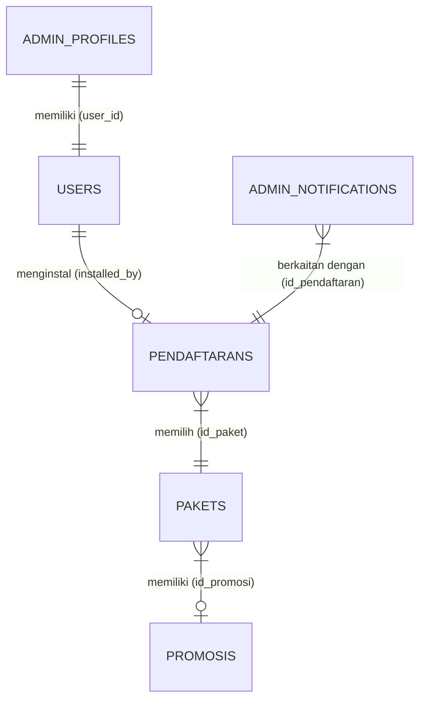

# ARTEFAK UAS APPL - ROLE 3: DATA DESIGNER

**SISTEM PENDAFTARAN LAYANAN INTERNET PROVIDER R-NET BERBASIS SINGLE-PAGE APPLICATION (SPA)**

---

## 👥 Profil Mahasiswa
*   **Nama Mahasiswa**  : [Nama Mahasiswa]
*   **NIM**             : [NIM Mahasiswa]
*   **Kelas / Semester**: D4 TRPL 2B / Semester 4
*   **Peran Utama**     : **Role 3 - Data Designer**
*   **Kasus Proyek**    : Proyek Pengembangan Sistem R-NET (PBL Kelompok)

---

## 🏛️ DAFTAR ISI
1.  [1. BUSINESS DATA ANALYSIS (Analisis Data Bisnis)](#1-business-data-analysis-analisis-data-bisnis)
    *   1.1 [Identifikasi Kebutuhan Data dari Proses Bisnis](#11-identifikasi-kebutuhan-data-dari-proses-bisnis)
    *   1.2 [Identifikasi Data Penting (Data Requirements)](#12-identifikasi-data-penting-data-requirements)
2.  [2. BUSINESS DATA MODELLING (Pemodelan Data Bisnis)](#2-business-data-modelling-pemodelan-data-bisnis)
    *   2.1 [Conceptual Data Model (ERD)](#21-conceptual-data-model-erd)
    *   2.2 [Deskripsi Hubungan Antar Entitas (Kardinalitas)](#22-deskripsi-hubungan-antar-entitas-kardinalitas)
3.  [3. LOGICAL DATABASE DESIGN (Desain Basis Data Logis)](#3-logical-database-design-desain-basis-data-logis)
    *   3.1 [Struktur Tabel & Kamus Data (Data Dictionary)](#31-struktur-tabel--kamus-data-data-dictionary)
4.  [4. DATA VALIDATION (Validasi Data)](#4-data-validation-validasi-data)
    *   4.1 [Integritas Data pada DBMS (PostgreSQL)](#41-integritas-data-pada-dbms-postgresql)
    *   4.2 [Aturan Bisnis & Validasi Sisi Backend (Laravel Eloquent)](#42-aturan-bisnis--validasi-sisi-backend-laravel-eloquent)
5.  [5. ARTEFAK & KETERLACAKAN DATA (Traceability)](#5-artefak--keterlacakan-data-traceability)
    *   5.1 [Hubungan Alur Proses ke Struktur Data](#51-hubungan-alur-proses-ke-struktur-data)

---

## 1. BUSINESS DATA ANALYSIS (Analisis Data Bisnis)

Sebagai Data Designer, tugas utama saya adalah mengidentifikasi kebutuhan data yang relevan dengan proses bisnis pendaftaran internet R-NET, dari proses registrasi mandiri pelanggan hingga penugasan teknisi di lapangan.

### 1.1 Identifikasi Kebutuhan Data dari Proses Bisnis
Data diidentifikasi berdasarkan interaksi aktor (Pelanggan, Admin, Teknisi) dengan sistem:
*   **Proses Pendaftaran Pelanggan**: Sistem membutuhkan data identitas lengkap pendaftar (Nama, Alamat, Wilayah, No HP), koordinat peta presisi (Latitude, Longitude), serta bukti fisik foto rumah (Path Gambar) untuk verifikasi teknis.
*   **Proses Pemilihan Layanan**: Sistem membutuhkan data paket internet (Nama Paket, Harga) dan promosi yang sedang aktif (Diskon, Masa Berlaku) untuk menghitung tarif pendaftaran.
*   **Proses Penugasan & Aktivasi**: Teknisi lapangan membutuhkan data teknis perangkat (Serial Number PON / modem, kredensial Wi-Fi) dan pencatatan nama teknisi yang menyelesaikan instalasi.
*   **Proses Monitoring & Dashboard**: Admin membutuhkan log notifikasi instan serta data statistik agregat harian pendaftaran untuk divisualisasikan dalam grafik tren.

### 1.2 Identifikasi Data Penting (Data Requirements)
Entitas-entitas data yang wajib dikelola oleh sistem R-NET meliputi:
1.  **User**: Mengelola informasi kredensial login admin dan teknisi.
2.  **Pendaftaran (Pendaftarans)**: Menyimpan data calon pelanggan, status verifikasi, koordinat GPS, hingga detail instalasi modem.
3.  **Paket**: Menyimpan jenis paket internet beserta poin keunggulan dan kustomisasi warnanya pada UI.
4.  **Promosi**: Menyimpan informasi diskon harga paket dan masa aktif promosi.
5.  **Pengumuman**: Menyimpan banner teks informasi yang dipasang di halaman portal publik.
6.  **Admin Notification**: Menyimpan log notifikasi real-time untuk admin saat ada pendaftaran masuk.

---

## 2. BUSINESS DATA MODELLING (Pemodelan Data Bisnis)

Pemodelan data bisnis mendefinisikan hubungan struktural antar entitas sebelum diimplementasikan ke dalam skema tabel fisik database PostgreSQL.

### 2.1 Conceptual Data Model (ERD)
Berikut adalah hubungan antarentitas dalam sistem R-NET yang digambarkan dengan Mermaid ER-Diagram:



### 2.2 Deskripsi Hubungan Antar Entitas (Kardinalitas)
1.  **USERS ke PENDAFTARANS (One-to-Many - Opsional)**:
    Satu user ber-role `teknisi` dapat ditugaskan untuk menginstal banyak data `pendaftaran` (diwakili oleh foreign key `installed_by`). Status hubungan ini opsional (`0..*`) karena saat pendaftaran baru masuk, data belum diasosiasikan dengan teknisi manapun.
2.  **PAKETS ke PROMOSIS (Many-to-One - Opsional)**:
    Banyak `pakets` dapat memiliki satu jenis `promosis` (diwakili oleh foreign key `id_promosi`). Hubungan ini opsional karena suatu paket internet tidak wajib selalu didiskon.
3.  **PENDAFTARANS ke PAKETS (Many-to-One - Mandatori)**:
    Setiap baris data `pendaftaran` harus terikat dengan satu `paket` internet yang dipilih pelanggan saat registrasi (diwakili oleh foreign key `id_paket`).
4.  **ADMIN_NOTIFICATIONS ke PENDAFTARANS (Many-to-One - Mandatori)**:
    Notifikasi dasbor admin dikaitkan secara spesifik ke satu pendaftaran yang memicu event notifikasi tersebut (diwakili oleh foreign key `id_pendaftaran`).

---

## 3. LOGICAL DATABASE DESIGN (Desain Basis Data Logis)

Transformasi ERD di atas ke dalam skema logis tabel database relasional Supabase PostgreSQL.

### 3.1 Struktur Tabel & Kamus Data (Data Dictionary)

#### A. Tabel: `users`
Menyimpan informasi identitas dan peran (role) dari administrator dan teknisi.
*   **Primary Key**: `id`

| Nama Kolom | Tipe Data | Nullable | Default | Keterangan / Constraint |
| :--- | :--- | :---: | :--- | :--- |
| `id` | BIGINT (unsigned) | NO | *Auto Increment* | Primary Key dari user. |
| `name` | VARCHAR(255) | NO | - | Nama lengkap user. |
| `email` | VARCHAR(255) | NO | - | Alamat email (Unique Constraint). |
| `password` | VARCHAR(255) | NO | - | Password yang telah di-hash (Bcrypt). |
| `role` | VARCHAR(30) | NO | 'pengguna' | Hak akses user: `admin` atau `teknisi`. |
| `created_at` | TIMESTAMP | YES | NULL | Waktu akun dibuat. |

#### B. Tabel: `pendaftarans`
Menyimpan data pendaftaran pelanggan, status instalasi, koordinat peta, dan penugasan teknisi.
*   **Primary Key**: `id_pendaftaran`

| Nama Kolom | Tipe Data | Nullable | Default | Keterangan / Constraint |
| :--- | :--- | :---: | :--- | :--- |
| `id_pendaftaran` | VARCHAR(5) | NO | - | Primary Key (Kode acak 5 digit unik). |
| `nama` | VARCHAR(50) | NO | - | Nama lengkap pelanggan. |
| `alamat` | VARCHAR(100) | NO | - | Alamat rumah pelanggan. |
| `latitude` | DECIMAL(10,8) | NO | 0.00000000 | Titik lintang peta Leaflet.js. |
| `longtitude` | DECIMAL(11,8) | NO | 0.00000000 | Titik bujur peta Leaflet.js. |
| `wilayah` | VARCHAR(100) | NO | - | Area/kecamatan pemasangan. |
| `nomor_tlpn` | VARCHAR(20) | NO | - | Nomor WhatsApp terdaftar. |
| `path_gambar` | VARCHAR(100) | YES | NULL | Lokasi file gambar rumah di S3 Storage. |
| `id_paket` | VARCHAR(5) | NO | - | Foreign Key ke tabel `pakets`. |
| `status` | VARCHAR(30) | NO | 'pending' | Status: `pending`, `validated`, `setup`, `active`, `rejected`. |
| `pon_sn` | VARCHAR(100) | YES | NULL | Serial Number modem (diinput teknisi). |
| `wifi_name` | VARCHAR(100) | YES | NULL | SSID nama Wi-Fi pelanggan. |
| `wifi_password` | VARCHAR(100) | YES | NULL | Password Wi-Fi (plaintext/terenkripsi). |
| `installed_by` | BIGINT (unsigned) | YES | NULL | Foreign Key ke `users.id` (set null on delete). |
| `installed_at` | TIMESTAMP | YES | NULL | Tanggal instalasi Wi-Fi diselesaikan. |

#### C. Tabel: `pakets`
Menyimpan jenis paket internet, konfigurasi harga, dan tema kustomisasi UI paket.
*   **Primary Key**: `id_paket`

| Nama Kolom | Tipe Data | Nullable | Default | Keterangan / Constraint |
| :--- | :--- | :---: | :--- | :--- |
| `id_paket` | VARCHAR(5) | NO | - | Primary Key (Kode paket, misal: PK01). |
| `title_paket` | VARCHAR(50) | NO | - | Nama paket internet (contoh: 20 Mbps). |
| `harga_paket` | INTEGER | NO | - | Nominal harga paket bulanan. |
| `id_promosi` | VARCHAR(5) | YES | NULL | Foreign Key ke `promosis.id_promosi` (set null). |
| `point_keunggulan` | TEXT / JSON | YES | NULL | Keunggulan paket, disimpan sebagai array/JSON. |
| `warna_bg` | VARCHAR(20) | YES | NULL | Warna latar belakang card paket di UI. |
| `is_hidden` | BOOLEAN | NO | false | Visibilitas paket di halaman utama. |

#### D. Tabel: `promosis`
Menyimpan promosi aktif yang memotong harga dasar paket internet.
*   **Primary Key**: `id_promosi`

| Nama Kolom | Tipe Data | Nullable | Default | Keterangan / Constraint |
| :--- | :--- | :---: | :--- | :--- |
| `id_promosi` | VARCHAR(5) | NO | - | Primary Key promosi. |
| `value_promosi` | INTEGER | NO | - | Nilai potongan harga paket (dalam Rupiah). |
| `text_promosi` | VARCHAR(255) | NO | - | Deskripsi promosi. |
| `valid_start` | DATETIME | NO | - | Batas awal berlakunya promosi. |
| `valid_end` | DATETIME | NO | - | Batas akhir berlakunya promosi. |

---

## 4. DATA VALIDATION (Validasi Data)

Untuk menjamin kualitas dan konsistensi data yang tersimpan di dalam sistem, saya menerapkan dua lapis pertahanan validasi: pada tingkat Database (PostgreSQL) dan tingkat Aplikasi (Laravel Model).

### 4.1 Integritas Data pada DBMS (PostgreSQL)
*   **Constraint Kunci (Keys Constraints)**: Penggunaan Primary Key bertipe VARCHAR unik dengan panjang dibatasi (`5` karakter) pada tabel master seperti `pakets`, `promosis`, dan `pengumumans` untuk efisiensi kueri pencarian.
*   **Foreign Key Constraints**: 
    *   `installed_by` pada `pendaftarans` diatur dengan constraint `ON DELETE SET NULL`. Jika akun seorang teknisi dihapus, riwayat instalasi pelanggan tidak ikut terhapus melainkan hanya dikosongkan pencatat teknisinya demi menjaga integritas pelaporan data histori.
    *   `id_promosi` pada `pakets` menggunakan `ON DELETE SET NULL`. Jika promosi berakhir dan datanya dihapus, paket internet terkait tetap aktif dan harga kembali normal tanpa merusak struktur database.
*   **Domain Constraints (Data Types)**: 
    *   Koordinat peta menggunakan tipe data `DECIMAL(10,8)` untuk latitude dan `DECIMAL(11,8)` untuk longitude agar mendukung penyimpanan tingkat presisi tinggi (hingga 6 angka di belakang koma) yang setara dengan akurasi 10-15 cm di permukaan bumi.

### 4.2 Aturan Bisnis & Validasi Sisi Backend (Laravel Eloquent)
Logika bisnis divalidasi pada controller sebelum disimpan ke database untuk mencegah anomali data:
1.  **Format Nomor Telepon**: Nomor WhatsApp pendaftar harus divalidasi dengan format regex khusus agar diawali oleh "+62" atau "08" demi konsistensi data saat penarikan laporan CSV (Validator: `regex:/^(\+62|08)[0-9]{8,15}$/`).
2.  **Validasi Tanggal Promosi/Pengumuman**: Aturan bisnis melarang tanggal akhir berlaku (`valid_end`) bernilai lebih kecil/sebelum tanggal mulai (`valid_start`). Hal ini divalidasi di controller dengan aturan `after:valid_start`.
3.  **Casting Atribut Model**: Di model [paket.php](file:///e:/SEMESTER4/PBL/Indeks/app/Models/paket.php), kolom `point_keunggulan` dideklarasikan bertipe array:
    ```php
    protected $casts = [
        'point_keunggulan' => 'array',
        'is_hidden' => 'boolean'
    ];
    ```
    Fitur casting ini otomatis melakukan serialisasi data array PHP menjadi format JSON saat disimpan ke database PostgreSQL, dan men-deserialize kembali menjadi array PHP saat dipanggil, menjaga konsistensi format data.

---

## 5. ARTEFAK & KETERLACAKAN DATA (Traceability)

Data yang dirancang harus memiliki keterlacakan yang jelas, mulai dari elisitasi kebutuhan hingga skema tabel database.

### 5.1 Hubungan Alur Proses ke Struktur Data
Tabel berikut memetakan keterlacakan antara Kebutuhan Fungsional (Requirements), Proses Bisnis (BPMN), dan tabel basis data relasional R-NET:

| Kebutuhan Fungsional (FR) | Use Case Terkait | Tabel Utama yang Mengelola | Kolom Kunci yang Terlibat |
| :--- | :--- | :--- | :--- |
| **FR-01** (Landing Page Informasi Paket & Promo) | **UC02**, **UC03** | `pakets`, `promosis`, `pengumumans` | `pakets.id_promosi` $\rightarrow$ `promosis.id_promosi` |
| **FR-02** (Registrasi Pelanggan & Koordinat Peta) | **UC04**, **UC05** | `pendaftarans` | `pendaftarans.id_paket`, `latitude`, `longtitude`, `path_gambar` |
| **FR-03** (Role-Based Access Control) | **UC07** | `users` | `users.role` (menyimpan nilai `admin` / `teknisi`) |
| **FR-06** (Update Status Pendaftar Asinkron) | **UC15** | `pendaftarans` | `pendaftarans.status` (`pending`, `validated`, etc.) |
| **FR-10** (Aktivasi Penugasan Wi-Fi Lapangan) | **UC22** | `pendaftarans`, `users` | `pendaftarans.pon_sn`, `wifi_name`, `wifi_password`, `installed_by` |
