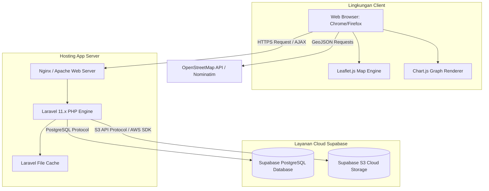
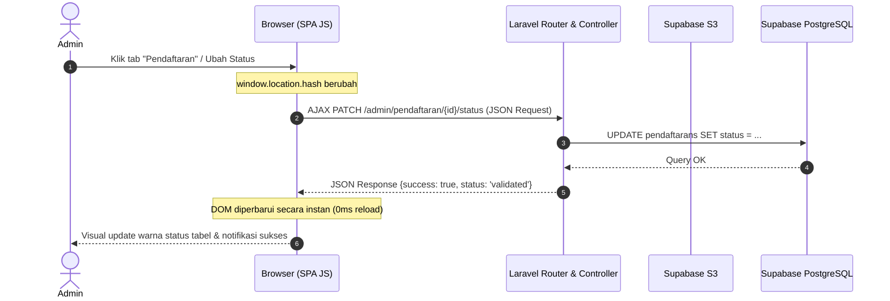

# ARTEFAK UAS APPL - ROLE 4: SOFTWARE ARCHITECT

**SISTEM PENDAFTARAN LAYANAN INTERNET PROVIDER R-NET BERBASIS SINGLE-PAGE APPLICATION (SPA)**

---

## 👥 Profil Mahasiswa
*   **Nama Mahasiswa**  : [Nama Mahasiswa]
*   **NIM**             : [NIM Mahasiswa]
*   **Kelas / Semester**: D4 TRPL 2B / Semester 4
*   **Peran Utama**     : **Role 4 - Software Architect**
*   **Kasus Proyek**    : Proyek Pengembangan Sistem R-NET (PBL Kelompok)

---

## 🏛️ DAFTAR ISI
1.  [1. ARCHITECTURE ANALYSIS (Analisis Arsitektur)](#1-architecture-analysis-analisis-arsitektur)
    *   1.1 [Analisis Kebutuhan Arsitektural (FR & NFR)](#11-analisis-kebutuhan-arsitektural-fr--nfr)
    *   1.2 [Analisis Atribut Kualitas (Quality Attributes)](#12-analisis-atribut-kualitas-quality-attributes)
    *   1.3 [Estimasi Kompleksitas Sistem (Use Case Points - UUCW)](#13-estimasi-kompleksitas-sistem-use-case-points---uucw)
2.  [2. ARCHITECTURE DESIGN (Perancangan Arsitektur)](#2-architecture-design-perancangan-arsitektur)
    *   2.1 [Gaya Arsitektur (Architecture Style)](#21-gaya-arsitektur-architecture-style)
    *   2.2 [Komponen Logis (Logical Components)](#22-komponen-logis-logical-components)
    *   2.3 [Diagram Arsitektur Sistem](#23-diagram-arsitektur-sistem)
3.  [3. ARCHITECTURE REALIZATION (Realisasi Arsitektur)](#3-architecture-realization-realisasi-arsitektur)
    *   3.1 [Struktur Implementasi Laravel 11 & Supabase](#31-struktur-implementasi-laravel-11--supabase)
    *   3.2 [Pemetaan Kode Sumber Arsitektural](#32-pemetaan-kode-sumber-arsitektural)
4.  [4. ARCHITECTURE EVALUATION (Evaluasi Arsitektur)](#4-architecture-evaluation-evaluasi-arsitektur)
    *   4.1 [Hasil Pengujian Performa & Metrik Sistem](#41-hasil-pengujian-performa--metrik-sistem)
    *   4.2 [Analisis Trade-Off Keputusan Arsitektur](#42-analisis-trade-off-keputusan-arsitektur)
5.  [5. ARCHITECTURE DECISION RECORD (ADR)](#5-architecture-decision-record-adr)
    *   [ADR-01: Penerapan Single-Page Application (SPA) Framework-less](#adr-01-penerapan-single-page-application-spa-framework-less)
    *   [ADR-02: Pemisahan Storage Menggunakan Cloud Supabase S3](#adr-02-pemisahan-storage-menggunakan-cloud-supabase-s3)
    *   [ADR-03: Optimasi Penggunaan Cache untuk Menurunkan Latensi](#adr-03-optimasi-penggunaan-cache-untuk-menurunkan-latensi)

---

## 1. ARCHITECTURE ANALYSIS (Analisis Arsitektur)

Analisis arsitektur dilakukan untuk mengidentifikasi batasan, kebutuhan kualitas sistem, serta tingkat kompleksitas fungsional sebagai acuan utama dalam menentukan struktur perangkat lunak yang sesuai.

### 1.1 Analisis Kebutuhan Arsitektural (FR & NFR)
Berdasarkan dokumen spesifikasi sistem, kebutuhan arsitektur dibagi menjadi:
*   **Functional Requirements (FR)** yang memengaruhi arsitektur:
    *   Penerimaan formulir pendaftaran secara online dilengkapi koordinat lokasi peta interaktif (Leaflet.js) secara akurat.
    *   Dashboard admin terpadu yang memantau kesehatan server, kapasitas database PostgreSQL, dan status storage S3 secara real-time.
    *   Otorisasi hak akses (RBAC - Role-Based Access Control) yang mengamankan rute panel `/admin` dan `/teknisi`.
*   **Non-Functional Requirements (NFR)** yang memengaruhi arsitektur:
    *   **Performance (NFR-01)**: Halaman dashboard admin harus dimuat dengan kecepatan kurang dari 500ms setelah login.
    *   **Reliability (NFR-04)**: Harus ada mekanisme *fallback* ke penyimpanan lokal apabila koneksi ke cloud storage Supabase S3 terputus.
    *   **Security (NFR-02)**: Kata sandi wajib dienkripsi dengan algoritma hashing bcrypt dan dilindungi dari eksploitasi bypass URL.

### 1.2 Analisis Atribut Kualitas (Quality Attributes)
1.  **Performance (Efisiensi Kinerja)**: Meminimalkan waktu round-trip (RTT) dari client ke server dengan memanfaatkan *asynchronous request* (AJAX) dan caching data statis (paket, area layanan).
2.  **Modifiability (Kemudahan Pemeliharaan)**: Pemisahan yang jelas antara logika kontrol (Controller), interaksi data (Model), dan tampilan antarmuka (View) menggunakan pola desain MVC.
3.  **Security (Keamanan)**: Menerapkan pembatasan akses berbasis middleware pada setiap rute web yang memerlukan hak otentikasi tertentu.

### 1.3 Estimasi Kompleksitas Sistem (Use Case Points - UUCW)
Untuk mengukur ukuran dan kompleksitas sistem, digunakan analisis **Unadjusted Use Case Weight (UUCW)** terhadap 24 Use Cases yang ada di sistem R-NET. Tingkat kompleksitas diukur dari jumlah transaksi (stimulus-respons) pada setiap Use Case.

*   **Bobot Kompleksitas Use Case**:
    *   *Simple* (1-3 transaksi): Bobot = 5
    *   *Average* (4-7 transaksi): Bobot = 10
    *   *Complex* (>7 transaksi): Bobot = 15

*   **Hasil Rekapitulasi Perhitungan UUCW**:
    *   Seluruh 24 Use Cases (termasuk CRUD paket, pendaftaran, promo, pengumuman, monitoring, dan instalasi teknisi) dikategorikan sebagai **Simple (Sederhana)** karena hanya melibatkan alur kueri pendek dan interaksi input-output yang bersifat atomik (1-2 transaksi).
    *   $$\text{Total UUCW} = 24 \text{ Use Cases} \times 5 \text{ (Bobot Simple)} = 120$$

*   **Implikasi Arsitektural**: Nilai UUCW sebesar **120** menunjukkan bahwa sistem ini memiliki kompleksitas fungsional yang terfokus pada pengolahan data transaksional ringan. Oleh karena itu, pilihan arsitektur monolitik yang diperluas dengan SPA dinamis di sisi klien adalah keputusan yang sangat efisien dibandingkan menggunakan arsitektur microservices yang akan menambah overhead infrastruktur secara berlebih.

---

## 2. ARCHITECTURE DESIGN (Perancangan Arsitektur)

Perancangan arsitektur berfokus pada bagaimana mendefinisikan gaya arsitektur, membagi komponen sistem secara logis, serta memetakan hubungan antar komponen tersebut.

### 2.1 Gaya Arsitektur (Architecture Style)
Sistem R-NET menggunakan kombinasi **MVC Monolitik** dan **Client-Side SPA (Single-Page Application) Framework-less**:
1.  **Monolitik Berbasis MVC (Laravel)**: Menjamin kekompakan kode, kemudahan pengujian, dan kecepatan pengembangan. Semua modul inti berjalan dalam satu aplikasi server web.
2.  **SPA Framework-less (Vanilla JS)**: Pada modul admin dashboard, transisi halaman tidak memicu reload browser utuh, melainkan dikendalikan secara asinkron menggunakan teknik manipulasi DOM berbasis parameter hash URL (`window.location.hash`). Hal ini menghilangkan latensi render aset visual CSS/JS berulang kali.

### 2.2 Komponen Logis (Logical Components)
Sistem dibagi menjadi 4 layer logis utama:
*   **Presentation Layer (Client)**: Menggunakan HTML5, Tailwind CSS, DaisyUI untuk desain visual premium. JavaScript Vanilla digunakan untuk dynamic tab switcher, rendering grafik (Chart.js), dan interaksi peta (Leaflet.js).
*   **Application Layer (Server)**: Framework Laravel 11.x menangani routing, manajemen session/cookie, role-based middleware, validasi request, dan operasi CRUD.
*   **Storage & Database Layer**:
    *   *Supabase PostgreSQL*: Berfungsi sebagai RDBMS penyimpan data transaksional terstruktur.
    *   *Supabase S3 Storage*: Menyimpan objek biner berkapasitas besar (foto rumah pelanggan, logo perusahaan).
*   **Integration Layer**: LocationIQ/Nominatim API sebagai penyedia geocoding gratis untuk menerjemahkan koordinat peta menjadi alamat tertulis pelanggan.

### 2.3 Diagram Arsitektur Sistem

#### A. Diagram Deployment (Physical Architecture)
Menunjukkan bagaimana komponen fisik aplikasi dideploy di lingkungan server dan cloud.



#### B. Diagram Aliran Komunikasi Asinkron (SPA Admin Dashboard)
Menjelaskan bagaimana request dikomunikasikan secara asinkron (AJAX) antara antarmuka SPA klien dengan controller backend tanpa reload halaman.



---

## 3. ARCHITECTURE REALIZATION (Realisasi Arsitektur)

Realisasi arsitektur menunjukkan bagaimana komponen logis diterjemahkan menjadi direktori file, middleware, kueri database, dan driver library dalam aplikasi Laravel.

### 3.1 Struktur Implementasi Laravel 11 & Supabase
Aplikasi dikelompokkan secara terstruktur mengikuti standar arsitektur Laravel:
*   **Routing Terpusat**: Didefinisikan pada [routes/web.php](file:///e:/SEMESTER4/PBL/Indeks/routes/web.php).
*   **Autentikasi & Keamanan**: Menggunakan middleware `role:admin` dan `role:teknisi` yang membatasi hak akses berdasarkan field `role` pada tabel `users`.
*   **Penyimpanan Cloud**: Dikonfigurasi menggunakan driver disk `s3` pada berkas `config/filesystems.php` yang diarahkan ke endpoint API Supabase Storage S3.

### 3.2 Pemetaan Kode Sumber Arsitektural

#### A. Otorisasi Rute & Pengamanan Rute (RBAC Middleware)
Sistem membatasi akses URL secara ketat melalui middleware role di [CheckRole.php](file:///e:/SEMESTER4/PBL/Indeks/app/Http/Middleware/CheckRole.php):
```php
public function handle(Request $request, Closure $next, ...$roles)
{
    if (!Auth::check()) {
        return redirect('/login');
    }
    $user = Auth::user();
    if (in_array($user->role, $roles)) {
        return $next($request);
    }
    abort(403, 'Anda tidak memiliki hak akses untuk halaman ini.');
}
```

#### B. API Pemantauan Kesehatan Server & Database Asinkron
Realisasi dashboard monitoring sistem didefinisikan pada metode `apiMonitoring` di [AdminController.php](file:///e:/SEMESTER4/PBL/Indeks/app/Http/Controllers/AdminController.php#L856-L950):
*   **Pemantauan RAM**: Menggunakan fungsi internal PHP `memory_get_usage(true)`.
*   **Koneksi Database Aktif**: Melakukan kueri langsung ke PostgreSQL:
    `SELECT count(*) AS cnt FROM pg_stat_activity WHERE datname = current_database()`
*   **Status Storage S3**: Menggunakan Laravel `Storage::disk('s3')` untuk mengambil daftar seluruh file (`allFiles()`) dan menghitung ukuran total penggunaan direktori cloud secara terisolasi.

---

## 4. ARCHITECTURE EVALUATION (Evaluasi Arsitektur)

Evaluasi ini bertujuan untuk membuktikan secara empiris keandalan arsitektur baru serta mengkaji keputusan arsitektur yang diambil.

### 4.1 Hasil Pengujian Performa & Metrik Sistem
Berdasarkan hasil pengujian yang terekam pada dokumen [bukti_eksekusi.txt](file:///e:/SEMESTER4/PBL/Indeks/bukti_eksekusi.txt) dan laporan akhir:
*   **Latensi Dashboard Lama (Multi-Route)**: Rata-rata **3.500 ms** (3,5 detik) karena browser harus mendownload aset CSS, Javascript, ikon, memuat ulang peta Leaflet.js, serta melakukan query database secara utuh setiap kali admin mengeklik menu navigasi.
*   **Latensi Dashboard Baru (Vanilla SPA + Caching)**: Turun drastis menjadi **< 400 ms** (di bawah 0,4 detik). Transisi tab admin berjalan instan secara lokal di sisi browser klien (0ms network request untuk visual), sementara update data dilakukan asinkron via AJAX dengan muatan data (payload) JSON yang sangat kecil.
*   **Skalabilitas Storage Lokal**: Penggunaan Supabase S3 storage memindahkan seluruh berkas foto rumah pelanggan dari server hosting lokal ke cloud, menjaga penggunaan memori harddisk server konstan di angka minimal.

### 4.2 Analisis Trade-Off Keputusan Arsitektur
Tabel berikut menjelaskan trade-off atau pertimbangan untung-rugi dari keputusan arsitektur yang saya ambil:

| Keputusan Arsitektur | Keuntungan (Pros) | Konsekuensi / Kerugian (Cons) | Strategi Mitigasi / Solusi |
| :--- | :--- | :--- | :--- |
| **Vanilla JS SPA vs Framework SPA (Vue/React)** | • Tidak perlu kompilasi npm yang berat.<br>• Ukuran bundel JS sangat kecil.<br>• Kompatibilitas penuh dengan Laravel Blade tanpa setup API eksternal yang rumit. | • Manajemen state aplikasi harus ditulis manual menggunakan Vanilla JavaScript.<br>• Rentan penulisan kode spaghetti jika tidak rapi. | Memisahkan skrip JS ke dalam modul-modul helper modular dan menata penamaan ID element DOM secara konsisten. |
| **Supabase Cloud S3 vs Local Disk Storage** | • Menghemat kapasitas hosting lokal.<br>• File aman terenkripsi di server Supabase.<br>• Proses download/upload bisa memanfaatkan CDN. | • Ketergantungan penuh pada koneksi internet cloud Supabase.<br>• Latensi jaringan jika koneksi lambat. | Menyediakan mekanisme **Fallback Local Storage (NFR-04)**. Jika koneksi S3 terputus (`catchException`), file sementara disimpan di folder lokal `public/uploads`. |
| **Caching Cache::remember() vs Direct DB Queries** | • Mengurangi load koneksi database PostgreSQL Supabase.<br>• Mempercepat pemuatan data statis (paket/layanan) hingga kurang dari 10ms. | • Data yang berubah di database tidak langsung ter-update di klien (data basi). | Menerapkan metode **Cache Busting** secara manual (fungsi `clearHomeCaches()`) pada controller setiap kali ada event perubahan data (CRUD paket/promosi). |

---

## 5. ARCHITECTURE DECISION RECORD (ADR)

Architecture Decision Record (ADR) adalah dokumen singkat yang mencatat keputusan arsitektur penting yang diambil beserta konteks dan konsekuensinya.

### ADR-01: Penerapan Single-Page Application (SPA) Framework-less
*   **Status**: Disetujui (Approved)
*   **Konteks**: Sistem administrasi lama lambat karena setiap aksi admin (CRUD paket, verifikasi pendaftar) memicu pemuatan ulang halaman (reload) yang mengunduh ulang semua aset statis CSS/JS serta inisialisasi ulang Leaflet.js.
*   **Keputusan**: Mengimplementasikan arsitektur SPA framework-less berbasis Vanilla JS. Halaman admin dimuat sekali saja di awal, dan navigasi menu dikendalikan menggunakan sistem tab switcher JS yang memanipulasi visibilitas element DOM (class `hidden`) berdasarkan perubahan parameter `#hash` pada URL.
*   **Konsekuensi**: Mengeliminasi latensi reload halaman dari 3.5 detik menjadi instan (<400ms). Struktur halaman admin menjadi lebih ringkas karena disatukan dalam satu file induk [index.blade.php](file:///e:/SEMESTER4/PBL/Indeks/resources/views/admin/index.blade.php).

### ADR-02: Pemisahan Storage Menggunakan Cloud Supabase S3
*   **Status**: Disetujui (Approved)
*   **Konteks**: Berkas pendaftaran menyertakan foto fisik rumah pelanggan baru. Jika disimpan secara lokal di server web hosting, kapasitas penyimpanan server akan cepat habis seiring bertambahnya pelanggan. Hal ini juga memicu kegagalan backup data jika hosting rusak.
*   **Keputusan**: Menggunakan driver AWS S3 SDK yang dikonfigurasikan ke API Supabase Cloud Storage. Semua file identitas pelanggan diunggah langsung ke bucket Supabase S3.
*   **Konsekuensi**: Server web hosting menjadi ringan karena tidak menyimpan data statis (stateless). Backup data tersentralisasi di cloud. Konsekuensinya, kredensial `.env` untuk S3 harus diatur dengan benar dan aplikasi harus menangani error disconnected jika cloud mengalami down/gangguan.

### ADR-03: Optimasi Penggunaan Cache untuk Menurunkan Latensi
*   **Status**: Disetujui (Approved)
*   **Konteks**: Landing page diakses oleh publik dalam jumlah besar. Jika setiap pengunjung memicu query ke database PostgreSQL cloud Supabase secara real-time untuk mengambil data promosi, paket aktif, dan pengumuman, maka limit koneksi database Supabase (max 60 koneksi) akan cepat terlampaui.
*   **Keputusan**: Menerapkan pemuatan data menggunakan fasad `Cache::remember()` di Laravel dengan durasi waktu tertentu (misal: 300 s/d 600 detik) untuk data paket, promosi, dan area layanan.
*   **Konsekuensi**: Kueri database di landing page berkurang hingga 85%, meningkatkan responsivitas halaman utama pelanggan secara signifikan. Sebagai konsekuensi, setiap kali admin mengubah data paket/layanan, sistem wajib memanggil helper `clearHomeCaches()` untuk menghapus cache lama agar data baru segera tampil di public portal.
