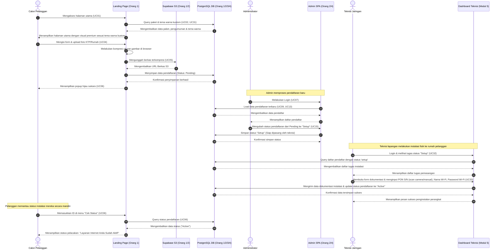

# Dokumentasi Fitur & Spesifikasi Use Case R-NET

Dokumen ini menjelaskan secara menyeluruh seluruh fitur dan fungsionalitas sistem **R-NET (Sistem Pendaftaran Internet Provider)**. Penjelasan dibagi berdasarkan modul fungsional pengembang, mencakup **33 Use Cases (UC01 - UC33)** yang didesain untuk sistem ini (termasuk fitur baru), beserta alur kerja (workflow) terintegrasi antar-modul.

---

## Daftar Isi
1. [Peta Fungsionalitas & Use Cases](#peta-fungsionalitas--use-cases)
2. [Modul 1: Portal Pelanggan & Front-End (Orang 1)](#modul-1-portal-pelanggan--front-end-orang-1)
3. [Modul 2: Manajemen Pendaftaran & Auth (Orang 2)](#modul-2-manajemen-pendaftaran--auth-orang-2)
4. [Modul 3: Konten Produk & Promosi (Orang 3)](#modul-3-konten-produk--promosi-orang-3)
5. [Modul 4: Monitoring Sistem & Pengumuman (Orang 4)](#modul-4-monitoring-sistem--pengumuman-orang-4)
6. [Modul 5: Portal & Dashboard Teknisi (Kolaboratif)](#modul-5-portal--dashboard-teknisi-kolaboratif)
7. [Alur Kerja Terintegrasi (Integration Workflows)](#alur-kerja-terintegrasi-integration-workflows)

---

## Peta Fungsionalitas & Use Cases

Sistem R-NET dirancang memiliki tiga aktor utama:
1.  **Calon Pelanggan / Pengguna Umum**: Mengakses portal publik untuk melihat penawaran, panduan pemasangan, mengirim umpan balik, dan mendaftar layanan.
2.  **Admin (Administrator / Developer)**: Mengakses area administrasi yang dilindungi keamanan untuk memantau sistem, memvalidasi pendaftar, mengelola peran (role), kustomisasi tema, dan mengelola konten produk/pengumuman.
3.  **Teknisi (Technician)**: Mengakses portal khusus teknisi untuk melihat tugas instalasi dan mengunggah dokumentasi fisik pemasangan perangkat.

```mermaid
graph TD
    subgraph Portal Pelanggan
        UC01[UC01: Melihat Halaman Utama]
        UC02[UC02: Melihat Informasi Paket]
        UC03[UC03: Melihat Pengumuman Aktif]
        UC04[UC04: Mengisi Formulir Pendaftaran]
        UC05[UC05: Mengunggah Berkas Identitas]
        UC06[UC06: Melihat Status Pendaftaran]
        UC26[UC26: Melihat Detail Panduan Pemasangan]
        UC27[UC27: Mengirim Umpan Balik via WA]
        
        UC04 -->|Include| UC05
        UC04 -->|Extend| UC06
    end

    subgraph Admin Panel SPA
        UC07[UC07: Melakukan Login]
        UC08[UC08: Melakukan Logout]
        
        subgraph Modul Pendaftaran & Peran
            UC13[UC13: Melihat Daftar Pendaftar]
            UC14[UC14: Melihat Detail Pendaftar]
            UC15[UC15: Mengubah Status Pendaftaran]
            UC16[UC16: Menghapus Data Pendaftar]
            UC28[UC28: Manajemen Akun & Peran]
            UC29[UC29: Menghubungi Pelanggan via WA Direct]
        end

        subgraph Modul Paket & Promosi
            UC17[UC17: Menambahkan Paket Baru]
            UC18[UC18: Mengubah Data Paket]
            UC19[UC19: Menghapus Data Paket]
            UC23[UC23: Menambahkan Promosi]
            UC24[UC24: Mengubah Promosi]
            UC25[UC25: Menghapus Promosi]
            UC30[UC30: Mengatur Label Tombol Beli Paket]
        end

        subgraph Modul Monitoring, Pengumuman & Tema
            UC09[UC09: Melihat Dashboard Utama]
            UC11[UC11: Melihat Monitoring Server]
            UC12[UC12: Melihat Monitoring DB & S3]
            UC20[UC20: Menambahkan Pengumuman]
            UC21[UC21: Mengubah Pengumuman]
            UC22[UC22: Menghapus Pengumuman]
            UC31[UC31: Mengubah Tema Landing Page & Panduan Pasang]
        end
    end

    subgraph Portal Teknisi
        UC32[UC32: Mengakses Dashboard Teknisi]
        UC33[UC33: Mengisi Dokumentasi Penginstalan]
    end

    CalonPelanggan((Calon Pelanggan)) --> PortalPelanggan
    Admin((Administrator)) --> AdminPanelSPA
    Teknisi((Teknisi)) --> PortalTeknisi
```
---

## Modul 1: Portal Pelanggan & Front-End (Orang 1)

Modul ini bertanggung jawab menyediakan portal pelanggan interaktif berbasis web yang memuat promosi, pengumuman, dan menangani pendaftaran calon pelanggan baru secara online.

### UC01: Melihat Halaman Utama
*   **Aktor**: Calon Pelanggan
*   **Tujuan**: Mengakses dan memuat landing page sistem R-NET.
*   **Kondisi Awal**: Server R-NET aktif dan browser pelanggan terhubung ke internet.
*   **Kondisi Akhir**: Halaman utama sistem berhasil dimuat dengan sempurna menampilkan navigasi, hero section, banner pengumuman, paket layanan, promosi, dan footer.
*   **Alur Utama**:
    1.  Calon pelanggan memasukkan alamat web (URL) R-NET di browser.
    2.  Sistem menerima permintaan dan memuat file view utama (landing page).
    3.  Sistem menyajikan konten landing page ke layar browser pelanggan.
*   **Alur Alternatif**:
    *   *Skenario Server down*: Browser mendeteksi server tidak merespon dan memunculkan *Request Timeout*.

### UC02: Melihat Informasi Paket
*   **Aktor**: Calon Pelanggan
*   **Tujuan**: Membaca deskripsi, kecepatan, dan harga paket internet yang ditawarkan.
*   **Kondisi Awal**: Calon pelanggan berada di Halaman Utama (UC01).
*   **Kondisi Akhir**: Daftar paket internet aktif tampil dengan data harga dan kecepatan terbaru.
*   **Alur Utama**:
    1.  Calon pelanggan menggeser layar (scroll) ke bagian "Paket Layanan".
    2.  Sistem mengambil data paket aktif secara langsung dari database PostgreSQL.
    3.  Sistem merender dan menampilkan kartu-kartu (cards) paket internet yang siap dipesan.

### UC03: Melihat Pengumuman Aktif
*   **Aktor**: Calon Pelanggan
*   **Tujuan**: Mengetahui informasi penting, promosi singkat, atau pemberitahuan maintenance.
*   **Kondisi Awal**: Calon pelanggan membuka Halaman Utama (UC01).
*   **Kondisi Akhir**: Banner teks pengumuman penting tampil di posisi atas halaman utama.
*   **Alur Utama**:
    1.  Sistem melakukan kueri pencarian pengumuman yang aktif hari ini berdasarkan filter tanggal (`valid_start` <= hari ini <= `valid_end`).
    2.  Sistem memuat teks pengumuman yang relevan.
    3.  Sistem menampilkan banner pengumuman di bagian paling atas/mencolok pada Halaman Utama.

### UC04: Mengisi Formulir Pendaftaran
*   **Aktor**: Calon Pelanggan
*   **Tujuan**: Mengirimkan data identitas diri dan peta lokasi rumah untuk berlangganan internet R-NET.
*   **Kondisi Awal**: Calon pelanggan mengklik tombol "Daftar Sekarang" pada salah satu paket layanan.
*   **Kondisi Akhir**: Formulir tervalidasi dan data tersimpan di database sebagai entri pendaftar baru berkategori `Pending`.
*   **Alur Utama**:
    1.  Calon pelanggan menekan tombol "Daftar" pada kartu paket yang dipilih.
    2.  Sistem memunculkan formulir pendaftaran interaktif (berisi kolom Nama, Nomor KTP, Email, No. HP, Alamat Lengkap, Koordinat GPS, dan Berkas Pendukung).
    3.  Calon pelanggan mengisi seluruh kolom isian.
    4.  Sistem memanggil fungsionalitas unggah berkas identitas (**UC05**).
    5.  Calon pelanggan menekan tombol "Kirim Pendaftaran".
    6.  Sistem memvalidasi kelengkapan data, lalu menyimpannya ke database PostgreSQL.
*   **Alur Alternatif**:
    *   *Data Tidak Valid*: Jika isian kosong atau tidak sesuai format (misal email salah), sistem menampilkan pesan error warna merah dan meminta pengguna melengkapi data tanpa me-refresh isian lainnya.

### UC05: Mengunggah Berkas Identitas (Include UC04)
*   **Aktor**: Calon Pelanggan
*   **Tujuan**: Melampirkan foto kartu identitas (KTP) / berkas pendukung sebagai berkas fisik verifikasi.
*   **Kondisi Awal**: Calon pelanggan sedang mengisi formulir pendaftaran (UC04).
*   **Kondisi Akhir**: File gambar berhasil diunggah ke Supabase S3 cloud storage dan tautan URL disimpan di database.
*   **Alur Utama**:
    1.  Calon pelanggan menekan tombol "Pilih Foto Berkas/KTP".
    2.  Calon pelanggan memilih file gambar dari galeri/perangkatnya.
    3.  Sistem melakukan kompresi ukuran gambar di sisi browser klien (untuk mengurangi bandwidth).
    4.  Sistem mengunggah file tersebut ke Supabase S3 Storage.
    5.  Sistem mengambil URL publik dari S3 dan mengaitkannya dengan data form pendaftaran.

### UC06: Melihat Status Pendaftaran (Extend UC04)
*   **Aktor**: Calon Pelanggan
*   **Tujuan**: Menerima informasi pop-up visual apakah pendaftaran berhasil disimpan ke sistem atau gagal.
*   **Kondisi Awal**: Calon pelanggan menekan tombol "Kirim Pendaftaran" (UC04).
*   **Kondisi Akhir**: Muncul umpan balik (feedback) grafis berupa modal status pendaftaran.
*   **Alur Utama**:
    1.  Sistem selesai memproses penyimpanan database pada UC04.
    2.  Sistem mengembalikan respons ke client.
    3.  Sistem menampilkan pop-up DaisyUI modal berwarna hijau: **"Pendaftaran Berhasil! Admin kami akan segera menghubungi Anda."**

### UC26: Melihat Detail Panduan Pemasangan Perangkat
*   **Aktor**: Calon Pelanggan / Pengguna Umum
*   **Tujuan**: Membaca panduan pemasangan perangkat (ONT/Modem/Kabel) secara detail sebelum/setelah mendaftar.
*   **Kondisi Awal**: Pelanggan berada di Landing Page R-NET.
*   **Kondisi Akhir**: Tampil bagian panduan langkah-demi-langkah pemasangan secara visual, interaktif, dan detail.
*   **Alur Utama**:
    1.  Pelanggan menggulir ke bagian "Panduan Pemasangan Perangkat".
    2.  Sistem memuat konten panduan (teks detail, langkah instalasi, gambar bantuan) yang datanya dinamis dari database.
    3.  Pelanggan membaca panduan tersebut.

### UC27: Mengirim Umpan Balik via Tombol WhatsApp Feedback
*   **Aktor**: Calon Pelanggan / Pengguna Umum
*   **Tujuan**: Menghubungi admin/layanan pelanggan secara langsung via WhatsApp jika ada keluhan atau pertanyaan.
*   **Kondisi Awal**: Pelanggan berada di Landing Page R-NET.
*   **Kondisi Akhir**: Dialihkan ke aplikasi WhatsApp dengan ruang chat admin R-NET.
*   **Alur Utama**:
    1.  Pelanggan melihat tombol feedback WhatsApp melayang di bagian kanan bawah halaman atau di area footer yang jelas.
    2.  Pelanggan mengklik tombol tersebut.
    3.  Sistem membuka tautan `https://wa.me/` (nomor admin yang terkonfigurasi dinamis) di tab baru.

---

## Modul 2: Manajemen Pendaftaran & Auth (Orang 2)

Modul ini memfasilitasi admin untuk login secara aman, meninjau pendaftar baru, melihat data fisik foto rumah/KTP dari cloud, mengubah status pendaftar, dan menghapus pendaftaran tidak valid.

### UC07: Melakukan Login
*   **Aktor**: Admin
*   **Tujuan**: Memverifikasi kredensial admin agar dapat mengelola dasbor sistem.
*   **Kondisi Awal**: Admin membuka halaman `/admin` (atau `/login`).
*   **Kondisi Akhir**: Sesi autentikasi aman (Session) dibuat, admin dialihkan ke Dashboard.
*   **Alur Utama**:
    1.  Admin memasukkan alamat Email dan Password terdaftar.
    2.  Admin menekan tombol "Login".
    3.  Sistem memverifikasi kredensial terhadap tabel `admins`.
    4.  Sistem membuat session login aktif dan mengarahkan Admin ke panel SPA `/admin`.
*   **Alur Alternatif**:
    *   *Kredensial salah*: Sistem menolak masuk, menampilkan toast error merah "Email atau password salah!", dan meminta isi ulang.

### UC08: Melakukan Logout
*   **Aktor**: Admin
*   **Tujuan**: Menghancurkan session login untuk mencegah akses ilegal.
*   **Kondisi Awal**: Admin sedang masuk ke sistem dan berada di Dashboard `/admin`.
*   **Kondisi Akhir**: Sesi dihancurkan, admin dialihkan kembali ke halaman utama / Login.
*   **Alur Utama**:
    1.  Admin mengklik menu dropdown profil di navbar atas, lalu menekan tombol "Logout".
    2.  Sistem menghancurkan session aktif admin di server.
    3.  Sistem mengalihkan browser admin ke halaman Login.

### UC13: Melihat Daftar Pendaftar
*   **Aktor**: Admin
*   **Tujuan**: Melihat data tabel kolektif dari seluruh calon pelanggan yang sudah mendaftar.
*   **Kondisi Awal**: Admin berhasil login dan berada di panel admin.
*   **Kondisi Akhir**: Tabel daftar pendaftar ditampilkan di layar secara rapi.
*   **Alur Utama**:
    1.  Admin mengklik menu "Pendaftaran" di sidebar kiri.
    2.  Sistem menyajikan daftar pendaftaran (yang telah dimuat di request pertama / di-fetch via AJAX) secara instan tanpa reload halaman.
    3.  Sistem merender tabel HTML berisi nama, email, paket, status, tanggal daftar, dan aksi.

### UC14: Melihat Detail Pendaftar
*   **Aktor**: Admin
*   **Tujuan**: Memeriksa detail alamat, nomor HP, foto rumah dari cloud storage, dan peta geografis Leaflet.js.
*   **Kondisi Awal**: Admin berada di halaman daftar pendaftar (UC13).
*   **Kondisi Akhir**: Modal detail pelanggan terbuka, menyajikan data terperinci, gambar dari S3, dan peta interaktif.
*   **Alur Utama**:
    1.  Admin mengklik tombol ikon "Detail" (Mata) pada baris pendaftar tertentu.
    2.  Sistem mengambil data lengkap pendaftar tersebut berdasarkan ID.
    3.  Sistem membuka modal popup berisi profil lengkap pelanggan dan memuat file gambar secara asinkron dari URL Supabase S3.
    4.  Sistem menginisialisasi Leaflet.js map untuk menandai lokasi koordinat rumah pendaftar di peta.
    5.  Admin menekan tombol "Close" untuk menutup modal.

### UC15: Mengubah Status Pendaftaran
*   **Aktor**: Admin
*   **Tujuan**: Memvalidasi status berlangganan pendaftar (misal: memproses pendaftaran menjadi Validated, Active, atau ditolak).
*   **Kondisi Awal**: Admin berada di halaman daftar pendaftar (UC13).
*   **Kondisi Akhir**: Status pendaftar berubah di database, warna lencana status di tabel terbarui otomatis via AJAX.
*   **Alur Utama**:
    1.  Admin mengklik tombol dropdown Status pada baris data pendaftar.
    2.  Admin memilih status baru (contoh: dari `Pending` ke `Validated` atau `Active`).
    3.  Sistem mengirimkan permintaan pembaruan status (HTTP PATCH/PUT) ke backend secara asinkron menggunakan Vanilla JS fetch API.
    4.  Backend mengupdate record di database PostgreSQL dan mengirim respons sukses.
    5.  Sistem memperbarui tampilan lencana status di tabel dan detail modal secara real-time tanpa me-refresh halaman.

### UC16: Menghapus Data Pendaftar
*   **Aktor**: Admin
*   **Tujuan**: Membersihkan data sampah, pendaftar fiktif, atau spam.
*   **Kondisi Awal**: Admin berada di halaman daftar pendaftar (UC13).
*   **Kondisi Akhir**: Record pendaftar terhapus di database PostgreSQL, berkas gambar terhapus dari Supabase S3, dan tabel terbarui secara instan.
*   **Alur Utama**:
    1.  Admin mengklik tombol ikon "Hapus" (Trash) di baris data target.
    2.  Sistem memunculkan modal dialog konfirmasi: **"Apakah Anda yakin ingin menghapus data ini beserta berkas fisiknya?"**.
    3.  Admin menekan tombol "Ya, Hapus".
    4.  Sistem mengirim permintaan penghapusan (DELETE) ke server.
    5.  Server menghapus berkas gambar pendaftar di cloud Supabase S3 menggunakan library S3 client.
    6.  Server menghapus baris data pendaftar terkait dari database PostgreSQL.
    7.  Sistem secara asinkron menghapus baris dari tabel HTML.

### UC28: Manajemen Akun & Peran (Role Management)
*   **Aktor**: Admin
*   **Tujuan**: Membuat, memperbarui, dan mengelola hak akses akun pengguna (Role: Admin, Teknisi, Pengguna biasa).
*   **Kondisi Awal**: Admin telah login dan membuka menu pengaturan akun.
*   **Kondisi Akhir**: Akun terdaftar memiliki tipe role yang tersimpan di database dan hak aksesnya dibatasi sesuai perannya.
*   **Alur Utama**:
    1.  Admin membuka menu "Manajemen Akun" di sidebar admin panel.
    2.  Sistem menampilkan daftar akun terdaftar beserta kolom role.
    3.  Admin dapat menambahkan akun baru dengan mengisi username, email, password, dan memilih role (`admin`, `teknisi`, `pengguna`).
    4.  Admin mengklik "Simpan", sistem memproses input dan memperbarui database.

### UC29: Menghubungi Pelanggan via WhatsApp Direct Link
*   **Aktor**: Admin
*   **Tujuan**: Menghubungi pelanggan secara cepat tanpa perlu menyalin nomor hp secara manual.
*   **Kondisi Awal**: Admin sedang membuka daftar pendaftar (UC13) atau detail pendaftar (UC14).
*   **Kondisi Akhir**: Admin dialihkan ke aplikasi WhatsApp web/mobile menuju nomor telepon pelanggan yang bersangkutan.
*   **Alur Utama**:
    1.  Admin melihat nomor telepon pelanggan pada baris tabel atau detail modal.
    2.  Nomor tersebut berupa tautan aktif (ikon WhatsApp).
    3.  Admin mengklik nomor/ikon tersebut.
    4.  Sistem membuka tab baru mengarah ke `https://wa.me/{nomor_pelanggan}` yang terformat otomatis.

---

## Modul 3: Konten Produk & Promosi (Orang 3)

Modul ini bertanggung jawab mengelola data paket internet (kecepatan, harga) dan promosi aktif yang nantinya disajikan secara dinamis kepada calon pelanggan di landing page.

### UC17: Menambahkan Paket Baru
*   **Aktor**: Admin
*   **Tujuan**: Memasukkan produk paket internet baru ke dalam sistem.
*   **Kondisi Awal**: Admin berada di tab "Paket Internet" di admin panel.
*   **Kondisi Akhir**: Paket baru tersimpan di database dan otomatis muncul di daftar admin serta Landing Page.
*   **Alur Utama**:
    1.  Admin mengklik tombol "+ Tambah Paket".
    2.  Sistem membuka modal form isian paket (ID Paket, Nama Paket, Kecepatan, Deskripsi, Harga Bulanan).
    3.  Admin mengisi form secara lengkap, lalu mengklik "Simpan".
    4.  Sistem mengirimkan form data ke backend.
    5.  Sistem memvalidasi ID Paket harus unik dan tipe data numerik sesuai.
    6.  Sistem menyimpan data ke tabel `pakets` dan memunculkan toast notifikasi sukses.

### UC18: Mengubah Data Paket
*   **Aktor**: Admin
*   **Tujuan**: Memperbarui rincian harga, kecepatan, atau deskripsi paket yang sudah ada.
*   **Kondisi Awal**: Admin berada di tab "Paket Internet".
*   **Kondisi Akhir**: Data paket diperbarui di database dan tampilan ter-update.
*   **Alur Utama**:
    1.  Admin mengklik tombol "Edit" pada salah satu baris paket.
    2.  Sistem menampilkan modal berisi form yang otomatis terisi dengan data paket saat ini.
    3.  Admin mengedit nilai harga atau deskripsi paket, lalu mengklik "Simpan Perubahan".
    4.  Sistem melakukan proses UPDATE pada database PostgreSQL.
    5.  Sistem memperbarui tampilan data paket secara asinkron di admin panel.

### UC19: Menghapus Data Paket
*   **Aktor**: Admin
*   **Tujuan**: Menghentikan penawaran paket layanan internet tertentu.
*   **Kondisi Awal**: Admin berada di tab "Paket Internet".
*   **Kondisi Akhir**: Paket terhapus secara permanen dari sistem database dan ditarik dari landing page.
*   **Alur Utama**:
    1.  Admin mengklik tombol "Hapus" pada paket target.
    2.  Sistem memunculkan dialog konfirmasi.
    3.  Admin mengonfirmasi penghapusan.
    4.  Sistem mengirimkan request DELETE ke database, menghapus record dari tabel `pakets`, dan memperbarui list visual di panel admin.

### UC23: Menambahkan Promosi
*   **Aktor**: Admin
*   **Tujuan**: Menambahkan program promosi/diskon baru untuk memikat pelanggan.
*   **Kondisi Awal**: Admin berada di tab "Promosi".
*   **Kondisi Akhir**: Record promosi baru tercatat di database dan dapat dimuat di landing page.
*   **Alur Utama**:
    1.  Admin mengklik tombol "+ Tambah Promosi".
    2.  Sistem menampilkan form (ID Promo, Nilai Diskon, Deskripsi Teks, Kode Promo, Tanggal Kadaluwarsa).
    3.  Admin mengisi form dan menekan "Simpan".
    4.  Sistem memvalidasi input (nilai diskon berupa angka), lalu menyimpannya ke tabel `promosis`.

### UC24: Mengubah Promosi
*   **Aktor**: Admin
*   **Tujuan**: Memperbarui deskripsi atau memperpanjang masa berlaku promosi.
*   **Kondisi Awal**: Admin berada di tab "Promosi".
*   **Kondisi Akhir**: Data promosi ter-update di database.
*   **Alur Utama**:
    1.  Admin mengklik tombol "Edit" pada promosi terpilih.
    2.  Sistem memunculkan modal form isian berisi data promosi lama.
    3.  Admin mengedit tanggal berakhir promo atau teks deskripsi.
    4.  Admin mengklik "Simpan".
    5.  Sistem melakukan kueri UPDATE ke database.

### UC25: Menghapus Promosi
*   **Aktor**: Admin
*   **Tujuan**: Menarik promosi yang sudah kadaluwarsa atau dihentikan secara permanen.
*   **Kondisi Awal**: Admin berada di tab "Promosi".
*   **Kondisi Akhir**: Record promosi terhapus dari database PostgreSQL.
*   **Alur Utama**:
    1.  Admin mengklik tombol "Hapus" pada promosi target.
    2.  Sistem memunculkan popup konfirmasi.
    3.  Admin mengklik konfirmasi hapus.
    4.  Sistem memproses perintah DELETE pada database dan memperbarui tampilan kartu promo.

### UC30: Mengatur Label Tombol Beli Paket
*   **Aktor**: Admin
*   **Tujuan**: Mengubah teks tombol panggilan tindakan (CTA) pada paket internet (misal dari "Daftar Paket" menjadi "Beli Paket", "Pesan Sekarang", dll) secara kustom per paket.
*   **Kondisi Awal**: Admin sedang menambah (UC17) atau mengedit (UC18) paket internet.
*   **Kondisi Akhir**: Teks tombol CTA berubah di database dan dirender dinamis di Landing Page.
*   **Alur Utama**:
    1.  Admin membuka form kustomisasi paket.
    2.  Admin mengisi field kustom "Teks Tombol CTA" (misal: "Beli Paket").
    3.  Admin mengklik "Simpan", data tombol tersimpan di tabel `pakets`.

---

## Modul 4: Monitoring Sistem & Pengumuman (Orang 4)

Modul ini bertanggung jawab memantau kesehatan operasional server, database PostgreSQL, kapasitas S3, menyajikan grafik dasbor Chart.js, serta memanajemen papan pengumuman dinamis.

### UC09: Melihat Dashboard Utama
*   **Aktor**: Admin / Developer
*   **Tujuan**: Membaca ringkasan agregasi data sistem secara instan dalam satu layar visual.
*   **Kondisi Awal**: Admin telah login dan berada di panel admin `/admin#dashboard`.
*   **Kondisi Akhir**: Dasbor memuat lengkap kartu total pendaftaran, total paket, total pengumuman, daftar pendaftaran terbaru, dan grafik tren pendaftaran.
*   **Alur Utama**:
    1.  Admin membuka dasbor utama.
    2.  Sistem menghitung agregasi total record tabel (`pendaftarans`, `pakets`, `pengumumans`).
    3.  Sistem mengambil data statistik pendaftaran 7 hari terakhir.
    4.  Sistem merender dasbor lengkap dengan panel ringkasan data.
    5.  Sistem memanggil Chart.js untuk menggambar grafik garis tren pendaftaran.

### UC11: Melihat Monitoring Server
*   **Aktor**: Admin / Developer
*   **Tujuan**: Mengecek performa dan pemakaian resource server web lokal/cloud.
*   **Kondisi Awal**: Admin berada di halaman Dasbor Utama (UC09).
*   **Kondisi Akhir**: Informasi penggunaan memori, durasi load time halaman, versi PHP, dan spesifikasi OS tampil di kartu pemantauan.
*   **Alur Utama**:
    1.  Admin menggulir (scroll) dasbor ke bagian bawah ke area "Monitoring Sistem".
    2.  Sistem memanggil fungsi PHP `memory_get_usage()` dan mengukur latency render via `microtime()`.
    3.  Sistem mengambil informasi konfigurasi sistem dari PHP Info secara aman.
    4.  Sistem menyajikan metrik performa tersebut pada tabel pemantauan server.
*   **Alur Alternatif**:
    *   *Fungsi dinonaktifkan*: Jika server mematikan fungsi pemantauan, tabel akan menampilkan tulisan anggun "N/A" (Tidak Tersedia) tanpa memicu crash 500.

### UC12: Melihat Monitoring Database & S3
*   **Aktor**: Admin / Developer
*   **Tujuan**: Mengecek status ketersediaan koneksi database PostgreSQL dan Cloud Storage Supabase S3 secara langsung.
*   **Kondisi Awal**: Admin berada di halaman Dasbor Utama (UC09).
*   **Kondisi Akhir**: Informasi ukuran database PostgreSQL, jumlah koneksi aktif, dan konektivitas bucket storage S3 tampil di panel monitoring.
*   **Alur Utama**:
    1.  Sistem secara background menjalankan kueri statistik PostgreSQL (`pg_database_size()`, `pg_stat_activity`).
    2.  Sistem mencoba mengirim ping/cek koneksi ke AWS S3 Client terkonfigurasi.
    3.  Sistem menampilkan status "Connected" berwarna hijau beserta statistik kapasitas jika koneksi berhasil.
*   **Alur Alternatif**:
    *   *Koneksi Terputus*: Jika database / S3 terputus, blok `try-catch` menangkap error tersebut dan merender status berwarna merah: **"Error / Disconnected"** tanpa merusak sisa visual dasbor utama.

### UC20: Menambahkan Pengumuman
*   **Aktor**: Admin
*   **Tujuan**: Membuat papan pengumuman/informasi gangguan untuk disajikan di landing page pelanggan.
*   **Kondisi Awal**: Admin berada di tab "Pengumuman" di panel admin.
*   **Kondisi Akhir**: Pengumuman baru tersimpan di database dan dijadwalkan terbit.
*   **Alur Utama**:
    1.  Admin mengklik "+ Buat Pengumuman".
    2.  Sistem menampilkan form input (Teks Pengumuman, Tanggal Mulai Berlaku, Tanggal Berakhir).
    3.  Admin mengisi data secara valid, lalu menekan "Simpan".
    4.  Sistem memproses penyimpanan ke database PostgreSQL.
    5.  Sistem memperbarui tabel daftar pengumuman secara asinkron.

### UC21: Mengubah Pengumuman
*   **Aktor**: Admin
*   **Tujuan**: Memperbaiki isi pengumuman atau memperpanjang/memperpendek masa tayang pengumuman.
*   **Kondisi Awal**: Admin berada di tab "Pengumuman".
*   **Kondisi Akhir**: Data pengumuman ter-update di database.
*   **Alur Utama**:
    1.  Admin mengklik tombol "Edit" pada pengumuman target.
    2.  Sistem membuka modal edit berisi form dengan data pengumuman lama.
    3.  Admin memperbarui teks atau durasi tanggal, lalu mengklik "Simpan".
    4.  Sistem mengeksekusi kueri UPDATE ke database PostgreSQL dan memperbarui tampilan daftar.

### UC22: Menghapus Pengumuman
*   **Aktor**: Admin
*   **Tujuan**: Menghapus pengumuman agar tidak lagi tampil di landing page pelanggan.
*   **Kondisi Awal**: Admin berada di tab "Pengumuman".
*   **Kondisi Akhir**: Pengumuman terhapus dari database dan dicabut dari landing page.
*   **Alur Utama**:
    1.  Admin mengklik "Hapus" di baris pengumuman target.
    2.  Sistem memunculkan pop-up konfirmasi.
    3.  Admin mengklik konfirmasi hapus.
    4.  Sistem mengeksekusi perintah DELETE di database dan menghapus list pengumuman terkait secara asinkron.

### UC31: Mengubah Tema Warna Landing Page & Panduan Pasang
*   **Aktor**: Admin
*   **Tujuan**: Mengatur warna primer, warna sekunder, warna latar belakang landing page, serta memodifikasi teks panduan pemasangan perangkat.
*   **Kondisi Awal**: Admin berada di tab "Pengaturan Perusahaan" atau "Pengaturan Landing Page".
*   **Kondisi Akhir**: Kustomisasi warna dan panduan terupdate di database (tabel `company_settings` / `landing_settings`) dan langsung diterapkan ke portal pelanggan.
*   **Alur Utama**:
    1.  Admin membuka menu "Pengaturan Tampilan" di admin panel.
    2.  Admin memilih palet warna landing page secara keseluruhan via color picker atau memilih preset tema warna.
    3.  Admin mengubah rincian teks petunjuk pemasangan perangkat pada editor teks yang disediakan.
    4.  Admin mengklik "Simpan Perubahan".
    5.  Sistem menyimpan data baru ke database dan memperbarui styling/konten landing page secara real-time.

---

## Modul 5: Portal & Dashboard Teknisi (Kolaboratif)

Modul ini menyediakan akses portal mandiri bagi kru lapangan/teknisi R-NET untuk melihat jadwal pekerjaan instalasi yang ditugaskan kepada mereka dan mendokumentasikan hasil pemasangan fisik di lokasi pelanggan.

### UC32: Mengakses Dashboard Teknisi
*   **Aktor**: Teknisi
*   **Tujuan**: Membuka dashboard tugas instalasi.
*   **Kondisi Awal**: Akun teknisi terdaftar, dan teknisi membuka halaman `/technician/login`.
*   **Kondisi Akhir**: Berhasil login dan dialihkan ke dashboard teknisi yang memuat daftar instalasi berstatus `Setup` (Siap Pasang).
*   **Alur Utama**:
    1.  Teknisi memasukkan email/username dan password di form login teknisi.
    2.  Sistem mencocokkan kredensial di database (memastikan kolom `role` bernilai `teknisi`).
    3.  Sistem menyajikan dashboard ringkas berisi daftar tugas instalasi: Nama Pelanggan, Alamat, Paket, Status, dan Tombol Dokumentasi.

### UC33: Mengisi Formulir Dokumentasi Penginstalan
*   **Aktor**: Teknisi
*   **Tujuan**: Mengunggah data teknis modem/ONT yang terpasang di rumah pelanggan sebagai tanda bukti selesai pemasangan.
*   **Kondisi Awal**: Teknisi memilih salah satu tugas instalasi aktif pada dasbornya.
*   **Kondisi Akhir**: Data PON S/N, nama Wi-Fi, dan password Wi-Fi tersimpan di database, dan status pendaftaran ter-update otomatis ke `Active` (Aktif).
*   **Alur Utama**:
    1.  Teknisi menekan tombol "Dokumentasi Instalasi" pada tugas pendaftaran tertentu.
    2.  Sistem menampilkan form dokumentasi berisi input: **Nomor PON S/N**, **Nama Wi-Fi (SSID)**, dan **Password Wi-Fi**.
    3.  Pada input PON S/N, teknisi dapat memilih untuk mengisi manual atau mengklik ikon "Scan Barcode/QR" untuk mengaktifkan kamera perangkat memindai stiker kode batang perangkat modem.
    4.  Teknisi melengkapi data dan menekan tombol "Kirim Dokumentasi".
    5.  Sistem memvalidasi, menyimpan data pemasangan ke database, dan mengubah status pendaftaran menjadi `Active` / `Aktif`.

---

## 🔄 Alur Kerja Terintegrasi (Integration Workflows)

Untuk mempermudah pemahaman bagaimana seluruh modul bekerja sama, berikut disajikan skenario interaksi sistem (End-to-End Workflow) dari proses pendaftaran, penugasan teknisi, hingga pemasangan selesai.

### Skenario: Alur Pendaftaran Hingga Pemasangan Selesai oleh Teknisi



---
*Dokumentasi PBL R-NET — 2026*
