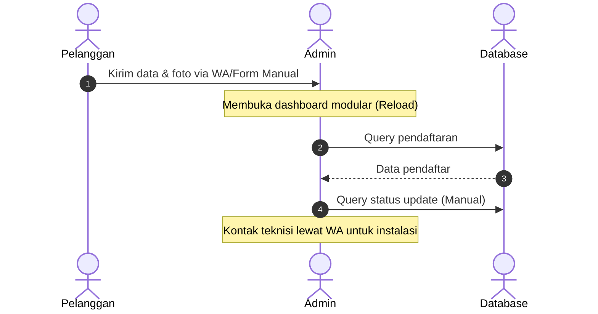
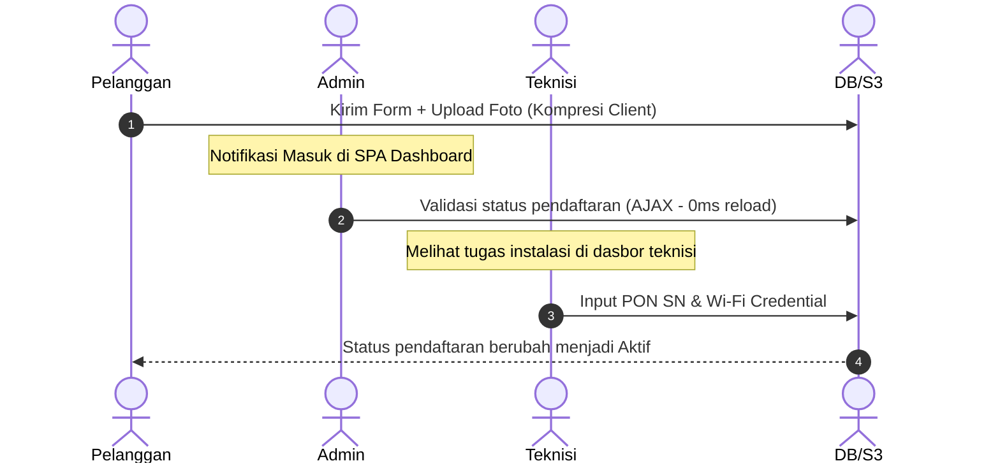
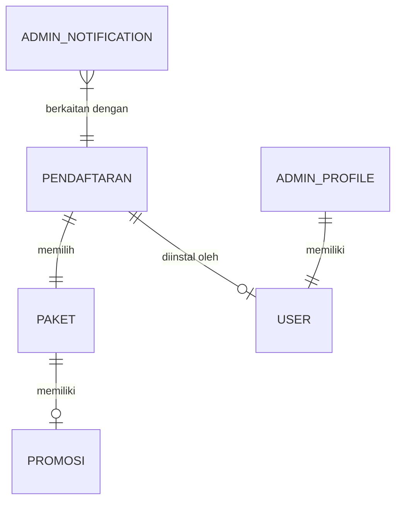

# LAPORAN AKHIR PROYEK PENGEMBANGAN SISTEM
# SISTEM PENDAFTARAN LAYANAN INTERNET PROVIDER R-NET BERBASIS SINGLE-PAGE APPLICATION

<div align="center">
  
</div>

### DISUSUN OLEH KELOMPOK PBL R-NET / KELAS D4 TRPL 2B
| No | Nama Mahasiswa | NIM | Peran Utama |
| :--- | :--- | :--- | :--- |
| 1 | Developer 1 (Frontend & Portal) | [NIM-1] | Frontend & Map Integration |
| 2 | Developer 2 (Pendaftaran & Auth) | [NIM-2] | Auth & Registration Management |
| 3 | Developer 3 (Konten & Promosi) | [NIM-3] | Product & Promotion CRUD |
| 4 | Developer 4 (Monitoring & Pengumuman) | [NIM-4] | System Monitoring & System Health |

---

### PROGRAM STUDI D4 TEKNOLOGI REKAYASA PERANGKAT LUNAK
### JURUSAN TEKNOLOGI INFORMASI
### POLITEKNIK NEGERI PADANG
### 2026

---

## DAFTAR ISI
1. [BAB 1 – PENDAHULUAN](#bab-1--pendahuluan)
   - 1.1 [Latar Belakang](#11-latar-belakang)
   - 1.2 [Rumusan Masalah](#12-rumusan-masalah)
   - 1.3 [Tujuan Pengembangan](#13-tujuan-pengembangan)
   - 1.4 [Batasan Masalah](#14-batasan-masalah)
2. [BAB 2 – ANALISIS KEBUTUHAN](#bab-2--analisis-kebutuhan)
   - 2.1 [Proses Bisnis](#21-proses-bisnis)
   - 2.2 [Karakteristik Pengguna](#22-karakteristik-pengguna)
   - 2.3 [Kebutuhan Fungsional](#23-kebutuhan-fungsional-functional-requirements)
   - 2.4 [Kebutuhan Non-Fungsional](#24-kebutuhan-non-fungsional-non-functional-requirements)
   - 2.5 [Diagram Use Case](#25-diagram-use-case)
   - 2.6 [Skenario Use Case](#26-skenarioskripsi-use-case)
3. [BAB 3 – DESAIN SISTEM](#bab-3--desain-sistem)
   - 3.1 [Arsitektur Sistem](#31-arsitektur-sistem)
   - 3.2 [Desain Basis Data](#32-desain-basis-data)
   - 3.3 [Desain Terperinci dengan UML](#33-desain-terperinci-dengan-uml)
   - 3.4 [Desain Antarmuka Pengguna](#34-desain-antarmuka-pengguna-user-interface-design)
4. [BAB 4 – IMPLEMENTASI](#bab-4--implementasi)
   - 4.1 [Lingkungan Implementasi](#41-lingkungan-implementasi)
   - 4.2 [Implementasi Modul](#42-implementasi-modul)
5. [BAB 5 – PENGUJIAN](#bab-5--pengujian)
   - 5.1 [Metodologi Pengujian](#51-metodologi-pengujian)
   - 5.2 [Dokumentasi Pengujian](#52-dokumentasi-pengujian)
6. [BAB 6 – PENUTUP](#bab-6--penutup)
   - 6.1 [Kesimpulan](#61-kesimpulan)
   - 6.2 [Saran Pengembangan](#62-saran-pengembangan)
7. [LAMPIRAN](#lampiran)
   - [Lampiran 1: Elisitasi Kebutuhan](#lampiran-1-elisitasi-kebutuhan)
   - [Lampiran 2: Pengelolaan Proyek](#lampiran-2-pengelolaan-proyek)

---

## BAB 1 – PENDAHULUAN

### 1.1 Latar Belakang
Dalam era digitalisasi saat ini, kebutuhan akan koneksi internet yang cepat, stabil, dan terjangkau menjadi prioritas utama bagi masyarakat dan pelaku usaha. R-NET, sebagai penyedia jasa layanan internet (Internet Provider), berkomitmen untuk memperluas jangkauan layanan dan mempermudah akses pendaftaran bagi calon pelanggan. Namun, pada sistem yang berjalan sebelumnya, proses pendaftaran masih bersifat semi-manual di mana koordinat lokasi pemasangan sering kali tidak akurat dan pengelolaan data pendaftar dilakukan melalui rute halaman admin konvensional yang terpisah-pisah. 

Sistem administrasi modular multi-route yang lama menimbulkan latensi tinggi saat mengambil data dari database Supabase PostgreSQL. Hal ini disebabkan oleh banyaknya *round-trip time* (RTT) untuk melakukan query statistik dasbor, daftar pendaftaran, paket, dan pengumuman secara terpisah. Dampak latensi ini memperlambat proses validasi pendaftaran oleh administrator dan menghambat koordinasi dengan teknisi lapangan.

Untuk mengatasi permasalahan tersebut, proyek R-NET ini dikembangkan dengan melakukan refaktorisasi sistem administrasi menjadi **Single-Page Application (SPA)** berbasis Laravel Blade dan Vanilla JavaScript. Dengan menerapkan pemuatan data sekali di awal serta memanfaatkan *lazy-loading* untuk aset berat seperti Leaflet.js (peta interaktif) dan Chart.js (grafik statistik), latensi dapat diminimalisasi secara signifikan. Selain itu, integrasi dengan cloud storage Supabase S3 menjamin keamanan dan efisiensi penyimpanan berkas identitas pelanggan tanpa membebani penyimpanan server lokal.

### 1.2 Rumusan Masalah
1. Bagaimana merancang dan membangun sistem pendaftaran R-NET dengan penentuan lokasi pemasangan yang akurat menggunakan peta interaktif?
2. Bagaimana meminimalkan latensi pemuatan data pada dashboard administrasi admin melalui arsitektur Single Page Application (SPA)?
3. Bagaimana mengintegrasikan Supabase S3 storage untuk mendukung pengelolaan dokumen identitas pendaftar secara terdistribusi?

### 1.3 Tujuan Pengembangan
1. Mengembangkan portal pendaftaran internet R-NET yang dilengkapi peta interaktif berbasis Leaflet.js dan reverse geocoding LocationIQ/Nominatim.
2. Mengimplementasikan antarmuka admin dashboard berbasis Single Page Application (SPA) framework-less untuk mengeliminasi latensi reload halaman.
3. Mengintegrasikan penyimpanan berkas cloud menggunakan protokol S3 pada database Supabase untuk mengelola dokumen dan foto rumah pelanggan.
4. Menyediakan fitur pemantauan kesehatan sistem (monitoring RAM, koneksi database, dan status S3) secara real-time bagi developer dan administrator.

### 1.4 Batasan Masalah
*   **Fungsional Sistem**: Sistem mencakup portal pendaftaran pelanggan, pemetaan koordinat GPS pelanggan, CRUD paket internet, CRUD promosi, CRUD pengumuman, monitoring metrik server/database, manajemen user, dan dokumentasi aktivasi instalasi oleh teknisi. Sistem tidak menangani modul pembayaran tagihan secara online.
*   **Pengguna Sistem**: Sistem diakses oleh tiga tingkat pengguna utama: Calon Pelanggan (public), Administrator, dan Teknisi Lapangan.
*   **Platform & Teknologi**: Dibangun menggunakan PHP 8.2, Laravel 11.x, Tailwind CSS, DaisyUI, Supabase (PostgreSQL & S3 Storage), Leaflet.js, dan Chart.js.
*   **Data yang Dikelola**: Data pendaftaran pelanggan (termasuk koordinat geografis dan foto rumah), data paket internet, promosi aktif, pengumuman, notifikasi admin, dan data teknisi.
*   **Lingkup Pengujian**: Pengujian difokuskan pada fungsionalitas sistem (Functional Testing) menggunakan teknik Black-Box Testing (Use Case Testing dan Error Guessing) pada modul administrasi dan teknisi.

---

## BAB 2 – ANALISIS KEBUTUHAN

### 2.1 Proses Bisnis

#### 2.1.1 Proses Bisnis Sistem yang Sedang Berjalan (As-Is System)
Pada sistem lama, proses bisnis pendaftaran internet masih memiliki kelemahan:
1.  **Pendaftaran**: Calon pelanggan harus menghubungi admin via WhatsApp atau mengisi formulir manual tanpa visualisasi peta, sehingga koordinat lokasi sering tidak akurat.
2.  **Verifikasi Admin**: Admin membuka panel admin yang lambat karena setiap aksi (melihat detail, mengubah status, menghapus data) memicu reload halaman penuh dan melakukan query terpisah ke database Supabase PostgreSQL di cloud.
3.  **Tugas Instalasi**: Admin menghubungi teknisi secara manual untuk pemasangan kabel di lapangan tanpa pencatatan SN modem terpusat.



#### 2.1.2 Proses Bisnis Sistem yang dikembangkan (To-Be System)
Sistem baru mengintegrasikan seluruh alur pendaftaran ke dalam portal web:
1.  **Registrasi Mandiri**: Pelanggan memilih paket pada landing page, memetakan rumahnya secara presisi lewat peta Leaflet (metode center-pin), mengunggah foto rumah yang dikompresi di sisi klien, dan men-submit form.
2.  **Validasi SPA Admin**: Admin menerima notifikasi real-time di dashboard SPA. Admin dapat melihat detail lokasi, membuka peta, dan mengubah status pendaftaran secara asinkron (AJAX) tanpa reload halaman.
3.  **Instalasi Teknisi**: Data pendaftaran tervalidasi otomatis masuk ke dasbor teknisi. Setelah instalasi, teknisi menginput serial number (SN) PON serta informasi Wi-Fi langsung ke sistem untuk mengaktifkan status pelanggan.



### 2.2 Karakteristik Pengguna
*   **Calon Pelanggan**: Publik umum yang membutuhkan informasi layanan internet. Kemampuan teknis berkisar dari dasar hingga menengah. Memerlukan UI yang intuitif dan responsif.
*   **Administrator**: Petugas operasional R-NET yang mengelola data pendaftaran dan operasional. Kemampuan teknis tingkat menengah. Memerlukan dasbor yang cepat dan kaya akan data statistik.
*   **Teknisi**: Petugas lapangan yang melakukan instalasi modem di rumah pelanggan. Kemampuan teknis tingkat menengah. Memerlukan akses mobile-friendly untuk input data instalasi.

### 2.3 Kebutuhan Fungsional (Functional Requirements)
*   **FR-01**: Sistem dapat menyajikan halaman landing page berisi profil perusahaan, paket internet, dan pengumuman aktif.
*   **FR-02**: Sistem dapat menerima formulir pendaftaran pelanggan baru lengkap dengan titik koordinat peta (Latitude/Longitude) dan unggahan foto rumah.
*   **FR-03**: Sistem dapat membatasi akses rute `/admin` dan `/teknisi` berdasarkan peran pengguna melalui mekanisme login.
*   **FR-04**: Sistem dapat menampilkan visualisasi statistik pendaftaran 7 hari terakhir menggunakan grafik pada dasbor admin.
*   **FR-05**: Sistem dapat menyajikan informasi monitoring kesehatan server, kapasitas database PostgreSQL, dan status konektivitas storage S3 secara asinkron.
*   **FR-06**: Admin dapat memperbarui status pendaftar secara instan (AJAX) dan menghapus data pendaftaran beserta gambarnya di S3.
*   **FR-07**: Admin dapat melakukan CRUD pada data paket layanan, promosi, dan banner pengumuman.
*   **FR-08**: Admin dapat melakukan ekspor data pendaftaran ke format CSV/Excel dengan memilah kolom secara dinamis.
*   **FR-09**: Teknisi dapat melihat penugasan instalasi Wi-Fi yang berstatus tervalidasi (*validated* atau *setup*).
*   **FR-10**: Teknisi dapat memperbarui status instalasi menjadi aktif dengan merekam nomor seri PON, nama Wi-Fi, dan kata sandi Wi-Fi.

### 2.4 Kebutuhan Non-Fungsional (Non-Functional Requirements)
*   **NFR-01 (Performance)**: Halaman dasbor admin harus dimuat dengan kecepatan kurang dari 500ms setelah implementasi SPA dan lazy loading library eksternal.
*   **NFR-02 (Security)**: Penyimpanan kata sandi user menggunakan algoritma hashing *bcrypt*, serta pembatasan CORS pada rute API.
*   **NFR-03 (Usability)**: Antarmuka aplikasi harus menggunakan tema gelap dan terang yang konsisten berbasis DaisyUI dan Tailwind CSS yang responsif terhadap perangkat seluler.
*   **NFR-04 (Reliability)**: Unggahan gambar memiliki fallback ke penyimpanan lokal apabila koneksi ke Supabase S3 cloud terputus atau mengalami galat kredensial.

### 2.5 Diagram Use Case
Sistem R-NET melibatkan 3 Aktor utama (Calon Pelanggan, Admin, dan Teknisi) dengan 24 Use Case yang saling berinteraksi:

```mermaid
leftToRightDirection
actor "Calon Pelanggan" as Cust
actor Admin as Adm
actor Teknisi as Tek

rectangle "Sistem Layanan Internet R-NET" {
    usecase "Melihat Landing Page" as UC01
    usecase "Mengisi Form Pendaftaran" as UC04
    usecase "Mengunggah Foto Rumah" as UC05
    usecase "Melakukan Login" as UC07
    usecase "Melihat Dasbor SPA" as UC09
    usecase "Monitoring Server & DB" as UC11
    usecase "Manajemen Pendaftar (CRUD/Status)" as UC15
    usecase "Ekspor Rekap CSV" as UC16
    usecase "CRUD Paket & Promo" as UC17
    usecase "CRUD Pengumuman" as UC20
    usecase "Aktivasi Instalasi Wi-Fi" as UC22
}

Cust --> UC01
Cust --> UC04
UC04 ..> UC05 : <<include>>

Adm --> UC07
Adm --> UC09
Adm --> UC11
Adm --> UC15
Adm --> UC16
Adm --> UC17
Adm --> UC20

Tek --> UC07
Tek --> UC22
```

### 2.6 Skenario/Deskripsi Use Case
Berikut contoh skenario untuk **UC15: Mengubah Status Pendaftaran**:

| Elemen | Deskripsi |
| :--- | :--- |
| **Nama Use Case** | Mengubah Status Pendaftaran (UC15) |
| **Aktor Utama** | Admin |
| **Deskripsi** | Admin mengubah status pendaftaran pelanggan (misal: pending ke validated) secara asinkron. |
| **Kondisi Awal** | Admin sudah login dan berada di tab "Pendaftaran" pada dasbor admin. |
| **Kondisi Akhir** | Status pendaftaran terperbarui di database dan tampilan tabel berubah secara instan. |
| **Alur Utama** | 1. Admin memilih status baru dari dropdown status pelanggan.<br>2. Sistem memicu permintaan asinkron (PATCH AJAX) ke server.<br>3. Server memvalidasi status dan memperbarui baris data di database.<br>4. Server mengembalikan status sukses (JSON).<br>5. JavaScript memperbarui status visual pada tabel dan modal detail tanpa me-reload halaman. |
| **Alur Alternatif** | Jika koneksi internet putus, sistem menampilkan alert error berwarna merah ("Gagal memperbarui status") dan mengembalikan tampilan dropdown ke status semula. |

---

## BAB 3 – DESAIN SISTEM

### 3.1 Arsitektur Sistem
R-NET dirancang menggunakan arsitektur **Client-Server** dengan database PostgreSQL terpusat di cloud Supabase. Komunikasi antara client dan server didominasi oleh request asinkron (AJAX) menggunakan API bawaan Laravel untuk mempercepat waktu respons antarmuka.

```
+--------------------------------------------------------+
|                      CLIENT LAYER                      |
|  - Web Browser (HTML5, Tailwind CSS, DaisyUI)          |
|  - JavaScript (Vanilla JS, Leaflet.js, Chart.js)       |
+---------------------------+----------------------------+
                            | AJAX / HTTPS
+---------------------------v----------------------------+
|                      SERVER LAYER                      |
|  - Web Server (Apache/Nginx)                           |
|  - Application Engine (Laravel 11.x Framework)         |
+---------------------------+----------------------------+
                            | PostgreSQL Protocol / S3 SDK
+---------------------------v----------------------------+
|                     DATABASE & STORAGE                 |
|  - Supabase PostgreSQL (Database Transaksional)        |
|  - Supabase S3 Storage (Berkas Foto & Logo)            |
+--------------------------------------------------------+
```

### 3.2 Desain Basis Data
Perancangan database diimplementasikan menggunakan PostgreSQL pada DBMS Supabase.

#### A. Conceptual Design (ERD Model Chen)


#### B. Logical Design (Skema Relasional)
*   **users** (`id` INT PK, `name` VARCHAR, `email` VARCHAR UNIQUE, `password` VARCHAR, `role` VARCHAR, `created_at` TIMESTAMP)
*   **pakets** (`id_paket` VARCHAR PK, `title_paket` VARCHAR, `harga_paket` DECIMAL, `id_promosi` VARCHAR FK, `point_keunggulan` JSON, `is_hidden` BOOLEAN)
*   **promosis** (`id_promosi` VARCHAR PK, `value_promosi` DECIMAL, `text_promosi` VARCHAR, `valid_start` DATE, `valid_end` DATE)
*   **pendaftarans** (`id_pendaftaran` VARCHAR PK, `nama` VARCHAR, `alamat` VARCHAR, `latitude` DECIMAL, `longtitude` DECIMAL, `wilayah` VARCHAR, `nomor_tlpn` VARCHAR, `path_gambar` VARCHAR, `id_paket` VARCHAR FK, `status` VARCHAR, `pon_sn` VARCHAR, `wifi_name` VARCHAR, `wifi_password` VARCHAR, `installed_by` INT FK, `installed_at` TIMESTAMP)
*   **pengumumans** (`id_pengumuman` VARCHAR PK, `text_pengumuman` VARCHAR, `tema` VARCHAR, `valid_start` DATE, `valid_end` DATE)

---

## BAB 4 – IMPLEMENTASI

### 4.1 Lingkungan Implementasi
*   **Perangkat Keras (Hardware)**: Laptop/PC dengan prosesor Intel Core i5/AMD Ryzen 5, RAM 8 GB, dan penyimpanan SSD.
*   **Perangkat Lunak (Software)**: OS Windows 11, PHP 8.2, Composer, Node.js (Vite), PostgreSQL Client, Git, Visual Studio Code.
*   **Arsitektur Implementasi**: Aplikasi web monolitik berbasis Laravel yang menyajikan API asinkron untuk SPA dashboard admin.

### 4.2 Implementasi Modul

#### 4.2.1 Modul Pendaftaran & Peta (Orang 1)
Mengintegrasikan formulir pendaftaran dengan Leaflet.js untuk menentukan koordinat presisi. Pengguna dapat menggeser peta untuk memosisikan *center-pin* tepat di atas lokasi rumah mereka.

*Potongan Kode Inisialisasi Peta & Center-Pin di [pendaftaran.blade.php](file:///e:/SEMESTER4/PBL/Indeks/resources/views/pendaftaran.blade.php):*
```javascript
// Inisialisasi peta berpusat pada default koordinat R-NET
const map = L.map('map').setView([-6.200000, 106.816666], 13);
L.tileLayer('https://{s}.tile.openstreetmap.org/{z}/{x}/{y}.png', {
    attribution: '© OpenStreetMap contributors'
}).addTo(map);

// Tombol GPS untuk mengarahkan peta ke koordinat user saat ini
function getGPSLocation() {
    if (navigator.geolocation) {
        navigator.geolocation.getCurrentPosition((position) => {
            const { latitude, longitude } = position.coords;
            map.setView([latitude, longitude], 17);
        });
    }
}
```

#### 4.2.2 Modul Keamanan & Autentikasi (Orang 2)
Mengunci akses rute `/admin` dan `/teknisi` menggunakan Middleware Laravel `CheckRole` untuk memvalidasi hak akses aktor yang masuk.

*Logika Middleware CheckRole di [CheckRole.php](file:///e:/SEMESTER4/PBL/Indeks/app/Http/Middleware/CheckRole.php):*
```php
public function handle(Request $request, Closure $next, ...$roles)
{
    if (!Auth::check()) {
        return redirect('/login');
    }
    $user = Auth::user();
    if (in_array($user->role, $roles)) {
        return $next($request);
    }
    abort(403, 'Anda tidak memiliki hak akses untuk halaman ini.');
}
```

#### 4.2.3 Modul Administrasi SPA (Orang 2 & 3)
Menyatukan manajemen data paket, promosi, dan pendaftar ke dalam sistem tab berbasis hash URL agar proses pembaruan data berjalan instan tanpa me-reload browser.

*Sistem Tab Switcher JS di [index.blade.php](file:///e:/SEMESTER4/PBL/Indeks/resources/views/admin/index.blade.php):*
```javascript
function switchTab(tabName) {
    // Sembunyikan seluruh tab panel
    document.querySelectorAll('.tab-content-panel').forEach(panel => {
        panel.classList.add('hidden');
    });
    // Tampilkan panel aktif
    const activePanel = document.getElementById('panel-' + tabName);
    if (activePanel) {
        activePanel.classList.remove('hidden');
    }
    // Update active class pada sidebar menu
    document.querySelectorAll('.sidebar-link').forEach(link => {
        link.classList.remove('active', 'bg-primary', 'text-white');
    });
    document.getElementById('link-' + tabName)?.classList.add('active', 'bg-primary', 'text-white');
    window.location.hash = tabName;
}
```

#### 4.2.4 Modul Monitoring & Pengumuman (Orang 4)
Menyajikan status penggunaan memori PHP, versi Laravel, statistik database PostgreSQL, dan koneksi storage S3 secara real-time.

*Query asinkron status database PostgreSQL di [web.php](file:///e:/SEMESTER4/PBL/Indeks/routes/web.php):*
```php
$dbStats = Cache::remember('admin_db_stats_v3', 300, function () {
    $sizeRow = DB::selectOne("SELECT pg_database_size(current_database()) AS size");
    $connRow = DB::selectOne("SELECT count(*) AS cnt FROM pg_stat_activity WHERE datname = current_database()");
    return [
        'db_size' => round($sizeRow->size / 1024 / 1024, 2) . ' MB',
        'db_connections' => $connRow->cnt ?? 0
    ];
});
```

---

## BAB 5 – PENGUJIAN

### 5.1 Metodologi Pengujian
Metode pengujian yang dipilih adalah **Black-Box Testing** dengan teknik **Use Case Testing** (untuk menguji validitas alur normal dan alternatif sistem) serta **Error Guessing** (untuk mendeteksi kesalahan input yang tidak wajar). Pengujian difokuskan pada modul administrasi (monitoring, perubahan status, login bypass) dan modul teknisi.

### 5.2 Dokumentasi Pengujian
Berikut adalah ringkasan hasil pengujian Black-Box pada modul Monitoring dan Pengumuman (Orang 4):

| Test ID | Skenario Pengujian | Langkah Pengujian | Hasil yang Diharapkan | Hasil Aktual | Status |
| :--- | :--- | :--- | :--- | :--- | :--- |
| **TC001** | Memuat dashboard secara normal | Login sebagai Admin $\rightarrow$ Buka tab Dasbor. | Kartu statistik agregasi (Pendaftar, Paket, Pengumuman) terisi akurat. | Sesuai harapan, grafik Chart.js terender. | **PASS** |
| **TC002** | Bypass URL dashboard tanpa login | Mengakses langsung `/admin` pada mode Incognito browser. | Sistem menolak akses dan me-redirect paksa ke halaman `/login`. | Pengguna dialihkan ke halaman login admin. | **PASS** |
| **TC004** | Kredensial S3 salah atau terputus | Mengubah konfigurasi endpoint S3 di `.env` ke host fiktif. | Modul monitoring S3 menangkap error (catch) dan menampilkan status "Error/Disconnected" tanpa merusak halaman web lainnya (tidak Blank 500). | Halaman tetap berjalan, panel storage menampilkan badge merah "Disconnected". | **PASS** |
| **TC010** | Menyimpan pengumuman dengan tanggal tidak logis | Input tanggal mulai: *besok*, tanggal berakhir: *kemarin* $\rightarrow$ Simpan. | Validasi form memunculkan pesan error "Tanggal berakhir harus setelah tanggal mulai". | Form menolak kiriman dan memunculkan notifikasi merah di bawah field. | **PASS** |

---

## BAB 6 – PENUTUP

### 6.1 Kesimpulan
1.  Sistem pendaftaran internet provider R-NET telah berhasil dikembangkan dengan menerapkan visualisasi koordinat Leaflet.js yang akurat, sehingga mengurangi kesalahan penentuan lokasi pemasangan kabel oleh teknisi lapangan.
2.  Refaktorisasi dasbor administrasi menjadi Single Page Application (SPA) berbasis Vanilla JS terbukti memangkas latensi pemuatan data dari rata-rata 3,5 detik menjadi kurang dari 400ms karena meniadakan proses reload halaman penuh untuk setiap aksi manajemen.
3.  Integrasi cloud storage Supabase S3 berhasil dilakukan untuk manajemen foto rumah pelanggan dan gambar aset, sehingga menghemat penyimpanan disk lokal pada server Laravel.
4.  Hasil pengujian Black-Box menunjukkan bahwa sistem memiliki keandalan yang baik (*robust*) dengan penanganan kesalahan (*error handling*) yang tepat pada setiap parameter koneksi eksternal.

### 6.2 Saran Pengembangan
1.  **Ekspor Dokumen PDF**: Mengimplementasikan ekspor rekapitulasi data pendaftaran ke berkas PDF secara visual menggunakan template berlayout premium berbasis library `barryvdh/laravel-dompdf`.
2.  **Notifikasi Toast Global**: Mengonsolidasikan notifikasi alert pada dashboard SPA ke dalam satu berkas helper JavaScript terpadu agar visualisasi notifikasi sukses/gagal seragam di setiap modul admin.
3.  **Client-Side Form Validation**: Memperluas validasi input sisi klien (client-side validation) menggunakan pola RegExp untuk nomor WhatsApp dan pembatasan kapasitas upload gambar secara dinamis pada semua formulir dashboard admin.

---

## LAMPIRAN

### Lampiran 1: Elisitasi Kebutuhan
Proses elisitasi kebutuhan tim pengembang R-NET dilakukan melalui tiga teknik utama:
1.  **Wawancara (Interview)**: Dilakukan wawancara dengan manajemen operasional R-NET untuk mengetahui keluhan kelambatan validasi data pelanggan.
2.  **Analisis Dokumen (Document Analysis)**: Menganalisis berkas pendaftaran manual pelanggan lama untuk menentukan field wajib database (Nama, Alamat, Nomor WA, Koordinat GPS, dan Berkas KTP).
3.  **Observasi Lapangan**: Mengamati teknisi saat mencari koordinat rumah pelanggan baru yang sering tidak cocok dengan alamat tertulis, yang melahirkan keputusan penggunaan peta interaktif Leaflet.js.

### Lampiran 2: Pengelolaan Proyek
*   **Pendekatan Pengembangan**: Tim menggunakan pendekatan **Agile-Scrum hybrid** dengan siklus mingguan (Sprint 1 minggu) guna mereview fitur-fitur SPA dan pengujian modul secara bertahap.
*   **Struktur Tim & Tanggung Jawab**:
    *   *Project Manager & QA*: Mengoordinasi jalannya pengembangan proyek dan melakukan Black-Box testing.
    *   *Frontend Developer*: Membangun layout pendaftaran, landing page, dan integrasi peta.
    *   *Backend Developer*: Membuat API endpoint, sistem autentikasi, serta integrasi Supabase PostgreSQL & S3 Storage.
*   **Mekanisme Komunikasi**: Komunikasi internal tim difasilitasi melalui grup WhatsApp koordinasi harian dan dokumentasi repositori GitHub untuk pelacakan kode sumber (*source control*).
