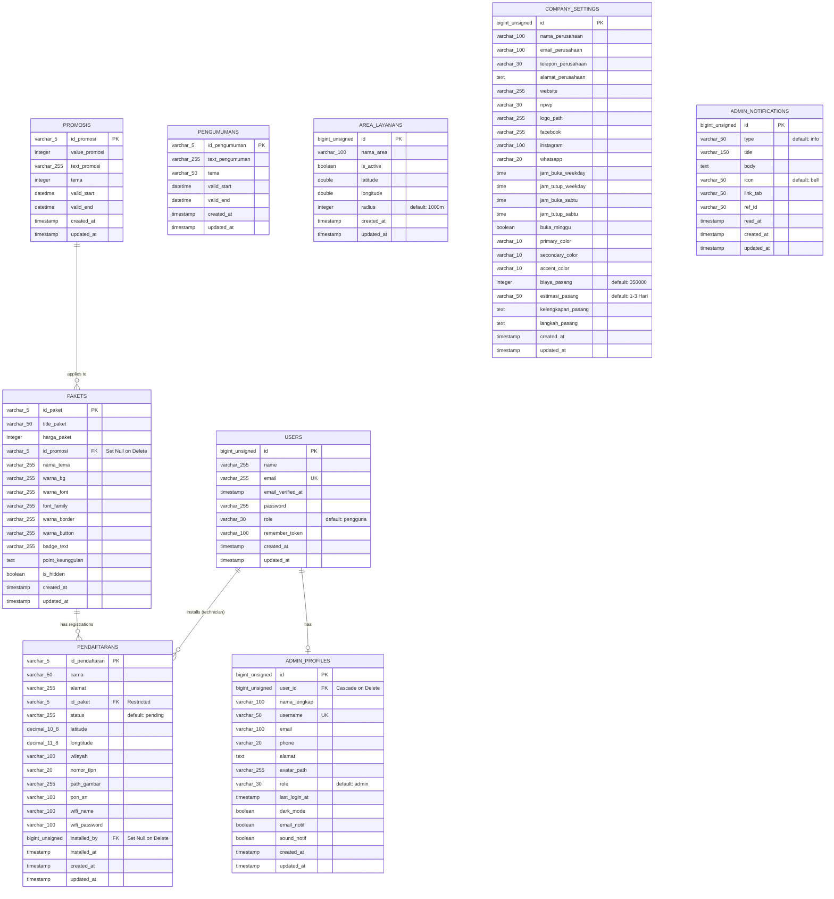

# Analisis Database, Diagram ERD, dan Skema Relasional (R-NET)

Dokumen ini berisi hasil analisis terhadap struktur database aplikasi **R-NET** berdasarkan file-file migrasi Laravel yang tersedia di dalam proyek.

---

## 1. Ringkasan & Tujuan Database

Database R-NET dirancang untuk mengelola operasional bisnis penyedia layanan internet (ISP) skala lokal/regional. Fungsi utama dari database ini meliputi:
1. **Manajemen Pengguna & Hak Akses**: Menyimpan data autentikasi untuk admin, teknisi, dan pengguna biasa (`users`, `admin_profiles`).
2. **Manajemen Produk/Layanan**: Menyimpan informasi paket internet beserta kustomisasi tampilan kartu/tema paket di halaman depan (`pakets`).
3. **Program Promosi**: Mengelola promosi harga atau diskon yang berlaku pada paket internet tertentu (`promosis`).
4. **Alur Pendaftaran Pelanggan**: Mencatat pendaftaran baru dari calon pelanggan, lengkap dengan koordinat lokasi pemasangan (latitude/longitude), status instalasi, serta informasi teknis pasca-instalasi (wifi name, password, teknisi penanggung jawab) (`pendaftarans`).
5. **Utilitas & Informasi Tambahan**: Mengelola pengumuman website (`pengumumans`), jangkauan area operasional berdasarkan radius koordinat (`area_layanans`), notifikasi sistem untuk admin (`admin_notifications`), serta konfigurasi visual dan operasional instansi/perusahaan (`company_settings`).

---

## 2. Diagram ERD (Entity-Relationship Diagram)

Berikut adalah visualisasi hubungan antarentitas dalam sistem R-NET menggunakan notasi Crow's Foot.

> [!NOTE]
> Tabel `admin_notifications` menggunakan kolom `ref_id` secara dinamis untuk mengaitkan notifikasi dengan `id_pendaftaran` (atau referensi entitas lainnya), namun tidak diikat dengan constraint Foreign Key fisik agar tetap fleksibel.

---

## 3. Skema Relasional (Relational Schema)

Berikut adalah representasi tekstual dari Skema Relasional. Kunci Utama (**Primary Key / PK**) ditandai dengan teks tebal dan garis bawah (**<u>PK</u>**), sedangkan Kunci Tamu (*Foreign Key / FK*) ditandai dengan teks miring dan tanda bintang (*FK*).

1. **users** (<u>**id**</u>, name, email, email_verified_at, password, role, remember_token, created_at, updated_at)
2. **admin_profiles** (<u>**id**</u>, *user_id (FK)*, nama_lengkap, username, email, phone, alamat, avatar_path, role, last_login_at, dark_mode, email_notif, sound_notif, created_at, updated_at)
   - *Foreign Key* `user_id` merujuk ke `users(id)` dengan aksi `ON DELETE CASCADE`.
3. **promosis** (<u>**id_promosi**</u>, value_promosi, text_promosi, tema, valid_start, valid_end, created_at, updated_at)
4. **pakets** (<u>**id_paket**</u>, title_paket, harga_paket, *id_promosi (FK)*, nama_tema, warna_bg, warna_font, font_family, warna_border, warna_button, badge_text, point_keunggulan, is_hidden, created_at, updated_at)
   - *Foreign Key* `id_promosi` merujuk ke `promosis(id_promosi)` dengan aksi `ON DELETE SET NULL`.
5. **pendaftarans** (<u>**id_pendaftaran**</u>, nama, alamat, *id_paket (FK)*, status, latitude, longtitude, wilayah, nomor_tlpn, path_gambar, pon_sn, wifi_name, wifi_password, *installed_by (FK)*, installed_at, created_at, updated_at)
   - *Foreign Key* `id_paket` merujuk ke `pakets(id_paket)` dengan aksi default.
   - *Foreign Key* `installed_by` merujuk ke `users(id)` dengan aksi `ON DELETE SET NULL`.
6. **pengumumans** (<u>**id_pengumuman**</u>, text_pengumuman, tema, valid_start, valid_end, created_at, updated_at)
7. **area_layanans** (<u>**id**</u>, nama_area, is_active, latitude, longitude, radius, created_at, updated_at)
8. **company_settings** (<u>**id**</u>, nama_perusahaan, email_perusahaan, telepon_perusahaan, alamat_perusahaan, website, npwp, logo_path, facebook, instagram, whatsapp, jam_buka_weekday, jam_tutup_weekday, jam_buka_sabtu, jam_tutup_sabtu, buka_minggu, primary_color, secondary_color, accent_color, biaya_pasang, estimasi_pasang, kelengkapan_pasang, langkah_pasang, created_at, updated_at)
9. **admin_notifications** (<u>**id**</u>, type, title, body, icon, link_tab, ref_id, read_at, created_at, updated_at)

---

## 4. Kamus Data & Spesifikasi Tabel

### 4.1 Tabel: `users`
Digunakan untuk menyimpan kredensial login utama bagi seluruh pengguna sistem (admin, pelanggan, teknisi).

| Nama Kolom | Tipe Data | Atribut/Constraint | Deskripsi |
| :--- | :--- | :--- | :--- |
| **id** | BIGINT UNSIGNED | PK, Auto Increment | ID unik pengguna |
| **name** | VARCHAR(255) | NOT NULL | Nama pengguna |
| **email** | VARCHAR(255) | NOT NULL, UNIQUE | Alamat email unik |
| **email_verified_at** | TIMESTAMP | NULL | Waktu verifikasi email |
| **password** | VARCHAR(255) | NOT NULL | Kredensial password terenkripsi |
| **role** | VARCHAR(30) | NOT NULL, Default: `'pengguna'` | Peran pengguna (misal: admin, teknisi, pengguna) |
| **remember_token** | VARCHAR(100) | NULL | Token sesi "Remember Me" |
| **created_at** | TIMESTAMP | NULL | Waktu pembuatan data |
| **updated_at** | TIMESTAMP | NULL | Waktu pembaruan data |

### 4.2 Tabel: `admin_profiles`
Menyimpan profil detail untuk pengguna dengan akses admin.

| Nama Kolom | Tipe Data | Atribut/Constraint | Deskripsi |
| :--- | :--- | :--- | :--- |
| **id** | BIGINT UNSIGNED | PK, Auto Increment | ID unik profil admin |
| **user_id** | BIGINT UNSIGNED | FK -> `users(id)`, NULL, Cascade On Delete | ID relasi ke tabel `users` |
| **nama_lengkap** | VARCHAR(100) | NOT NULL | Nama lengkap admin |
| **username** | VARCHAR(50) | NOT NULL, UNIQUE | Username admin unik |
| **email** | VARCHAR(100) | NOT NULL | Alamat email |
| **phone** | VARCHAR(20) | NULL | Nomor telepon/HP |
| **alamat** | TEXT | NULL | Alamat tempat tinggal |
| **avatar_path** | VARCHAR(255) | NULL | Path gambar avatar |
| **role** | VARCHAR(30) | NOT NULL, Default: `'admin'` | Peran detail admin |
| **last_login_at** | TIMESTAMP | NULL | Sesi login terakhir |
| **dark_mode** | BOOLEAN | NOT NULL, Default: `false` | Pengaturan tampilan gelap |
| **email_notif** | BOOLEAN | NOT NULL, Default: `true` | Pengaturan notifikasi email |
| **sound_notif** | BOOLEAN | NOT NULL, Default: `false` | Pengaturan notifikasi suara |
| **created_at** | TIMESTAMP | NULL | Waktu pembuatan data |
| **updated_at** | TIMESTAMP | NULL | Waktu pembaruan data |

### 4.3 Tabel: `promosis`
Menyimpan data promo yang dapat dihubungkan ke paket layanan tertentu.

| Nama Kolom | Tipe Data | Atribut/Constraint | Deskripsi |
| :--- | :--- | :--- | :--- |
| **id_promosi** | VARCHAR(5) | PK | Kode unik promosi |
| **value_promosi** | INTEGER | NOT NULL | Nilai potongan / value promosi |
| **text_promosi** | VARCHAR(255) | NOT NULL | Keterangan/deskripsi promosi |
| **tema** | INTEGER | NOT NULL | Kode tema tampilan promo |
| **valid_start** | DATETIME | NOT NULL | Tanggal mulai berlaku |
| **valid_end** | DATETIME | NOT NULL | Tanggal berakhir promo |
| **created_at** | TIMESTAMP | NULL | Waktu pembuatan data |
| **updated_at** | TIMESTAMP | NULL | Waktu pembaruan data |

### 4.4 Tabel: `pakets`
Menyimpan informasi paket internet yang ditawarkan ke pelanggan beserta kustomisasi CSS kartu paket.

| Nama Kolom | Tipe Data | Atribut/Constraint | Deskripsi |
| :--- | :--- | :--- | :--- |
| **id_paket** | VARCHAR(5) | PK | Kode unik paket internet |
| **title_paket** | VARCHAR(50) | NOT NULL | Nama/Judul paket internet |
| **harga_paket** | INTEGER | NOT NULL | Harga bulanan paket |
| **id_promosi** | VARCHAR(5) | FK -> `promosis(id_promosi)`, NULL, Set Null on Delete | Kode promosi terkait |
| **nama_tema** | VARCHAR(255) | NULL | Nama tema visual |
| **warna_bg** | VARCHAR(255) | NULL | Warna latar belakang kartu paket |
| **warna_font** | VARCHAR(255) | NULL | Warna teks kartu paket |
| **font_family** | VARCHAR(255) | NULL | Jenis font kartu paket |
| **warna_border** | VARCHAR(255) | NULL | Warna garis tepi kartu paket |
| **warna_button** | VARCHAR(255) | NULL | Warna tombol beli |
| **badge_text** | VARCHAR(255) | NULL | Teks lencana promo (misal: "Terpopuler") |
| **point_keunggulan** | TEXT | NULL | JSON list dari fitur-fitur paket |
| **is_hidden** | BOOLEAN | NOT NULL, Default: `false` | Status disembunyikan dari halaman depan |
| **created_at** | TIMESTAMP | NULL | Waktu pembuatan data |
| **updated_at** | TIMESTAMP | NULL | Waktu pembaruan data |

### 4.5 Tabel: `pendaftarans`
Menampung data registrasi pelanggan baru beserta data teknis pasca-pemasangan oleh teknisi.

| Nama Kolom | Tipe Data | Atribut/Constraint | Deskripsi |
| :--- | :--- | :--- | :--- |
| **id_pendaftaran** | VARCHAR(5) | PK | Kode pendaftaran unik |
| **nama** | VARCHAR(50) | NOT NULL | Nama calon pelanggan |
| **alamat** | VARCHAR(255) | NOT NULL | Alamat instalasi |
| **id_paket** | VARCHAR(5) | FK -> `pakets(id_paket)`, NOT NULL | Paket internet pilihan |
| **status** | VARCHAR(255) | NOT NULL, Default: `'pending'` | Status pendaftaran (misal: pending, active, dll) |
| **latitude** | DECIMAL(10,8) | NOT NULL | Koordinat latitude lokasi |
| **longtitude** | DECIMAL(11,8) | NOT NULL | Koordinat longitude lokasi |
| **wilayah** | VARCHAR(100) | NOT NULL | Nama wilayah / kelurahan |
| **nomor_tlpn** | VARCHAR(20) | NOT NULL | Nomor kontak pelanggan |
| **path_gambar** | VARCHAR(255) | NULL | File bukti/foto lokasi |
| **pon_sn** | VARCHAR(100) | NULL | Serial Number perangkat ONU/GPON |
| **wifi_name** | VARCHAR(100) | NULL | Nama SSID Wifi yang dipasang |
| **wifi_password** | VARCHAR(100) | NULL | Sandi Wifi yang dipasang |
| **installed_by** | BIGINT UNSIGNED | FK -> `users(id)`, NULL, Set Null on Delete | Teknisi yang melakukan instalasi |
| **installed_at** | TIMESTAMP | NULL | Tanggal penyelesaian instalasi |
| **created_at** | TIMESTAMP | NULL | Waktu registrasi |
| **updated_at** | TIMESTAMP | NULL | Waktu pembaruan data |

### 4.6 Tabel: `pengumumans`
Menyimpan teks informasi yang dipasang di landing page.

| Nama Kolom | Tipe Data | Atribut/Constraint | Deskripsi |
| :--- | :--- | :--- | :--- |
| **id_pengumuman** | VARCHAR(5) | PK | Kode unik pengumuman |
| **text_pengumuman** | VARCHAR(255) | NOT NULL | Teks isi pengumuman |
| **tema** | VARCHAR(50) | NOT NULL | Tema/Warna pengumuman |
| **valid_start** | DATETIME | NOT NULL | Mulai ditayangkan |
| **valid_end** | DATETIME | NOT NULL | Selesai ditayangkan |
| **created_at** | TIMESTAMP | NULL | Waktu pembuatan data |
| **updated_at** | TIMESTAMP | NULL | Waktu pembaruan data |

### 4.7 Tabel: `area_layanans`
Menyimpan batas jangkauan Wifi/Internet ISP berdasarkan koordinat dan radius lingkaran.

| Nama Kolom | Tipe Data | Atribut/Constraint | Deskripsi |
| :--- | :--- | :--- | :--- |
| **id** | BIGINT UNSIGNED | PK, Auto Increment | ID area unik |
| **nama_area** | VARCHAR(100) | NOT NULL | Nama area/wilayah jangkauan |
| **is_active** | BOOLEAN | NOT NULL, Default: `true` | Status aktif jangkauan |
| **latitude** | DOUBLE | NULL | Koordinat latitude pusat pemancar/POP |
| **longitude** | DOUBLE | NULL | Koordinat longitude pusat pemancar/POP |
| **radius** | INTEGER | NOT NULL, Default: `1000` | Radius jangkauan sinyal (dalam meter) |
| **created_at** | TIMESTAMP | NULL | Waktu pembuatan data |
| **updated_at** | TIMESTAMP | NULL | Waktu pembaruan data |

### 4.8 Tabel: `company_settings`
Menyimpan konfigurasi instansi/perusahaan, biaya, estimasi, serta styling warna utama landing page.

| Nama Kolom | Tipe Data | Atribut/Constraint | Deskripsi |
| :--- | :--- | :--- | :--- |
| **id** | BIGINT UNSIGNED | PK, Auto Increment | ID konfigurasi tunggal (Singleton) |
| **nama_perusahaan** | VARCHAR(100) | NOT NULL | Nama instansi perusahaan |
| **email_perusahaan**| VARCHAR(100) | NULL | Kontak email instansi |
| **telepon_perusahaan**| VARCHAR(30) | NULL | Kontak telepon instansi |
| **alamat_perusahaan**| TEXT | NULL | Alamat kantor pusat |
| **website** | VARCHAR(255) | NULL | URL situs web resmi |
| **npwp** | VARCHAR(30) | NULL | Nomor wajib pajak |
| **logo_path** | VARCHAR(255) | NULL | Path logo instansi |
| **facebook** | VARCHAR(255) | NULL | Akun sosial media Facebook |
| **instagram** | VARCHAR(100) | NULL | Akun sosial media Instagram |
| **whatsapp** | VARCHAR(20) | NULL | Kontak WhatsApp admin |
| **jam_buka_weekday** | TIME | NULL | Jam operasional buka hari biasa |
| **jam_tutup_weekday**| TIME | NULL | Jam operasional tutup hari biasa |
| **jam_buka_sabtu** | TIME | NULL | Jam operasional buka hari Sabtu |
| **jam_tutup_sabtu** | TIME | NULL | Jam operasional tutup hari Sabtu |
| **buka_minggu** | BOOLEAN | NOT NULL, Default: `false` | Status operasional hari Minggu |
| **primary_color** | VARCHAR(10) | NULL | Kode warna utama (Hex/HSL) |
| **secondary_color** | VARCHAR(10) | NULL | Kode warna sekunder |
| **accent_color** | VARCHAR(10) | NULL | Kode warna aksen/sorotan |
| **biaya_pasang** | INTEGER | NOT NULL, Default: `350000` | Biaya instalasi awal |
| **estimasi_pasang** | VARCHAR(50) | NOT NULL, Default: `'1-3 Hari Kerja'` | Perkiraan durasi pasang |
| **kelengkapan_pasang**| TEXT | NULL | Rincian alat/fasilitas yang didapat pelanggan |
| **langkah_pasang** | TEXT | NULL | Prosedur pendaftaran dan instalasi |
| **created_at** | TIMESTAMP | NULL | Waktu pembuatan data |
| **updated_at** | TIMESTAMP | NULL | Waktu pembaruan data |

### 4.9 Tabel: `admin_notifications`
Menampung log pemberitahuan aktivitas aplikasi untuk kebutuhan Dashboard admin.

| Nama Kolom | Tipe Data | Atribut/Constraint | Deskripsi |
| :--- | :--- | :--- | :--- |
| **id** | BIGINT UNSIGNED | PK, Auto Increment | ID notifikasi unik |
| **type** | VARCHAR(50) | NOT NULL, Default: `'info'` | Kategori keparahan (info, success, warning, danger) |
| **title** | VARCHAR(150) | NOT NULL | Judul notifikasi |
| **body** | TEXT | NULL | Isi detail notifikasi |
| **icon** | VARCHAR(50) | NOT NULL, Default: `'bell'` | Nama class icon (misal: bell, user-plus) |
| **link_tab** | VARCHAR(50) | NULL | Referensi tujuan navigasi SPA |
| **ref_id** | VARCHAR(50) | NULL | ID referensi data terkait (misal: `id_pendaftaran`) |
| **read_at** | TIMESTAMP | NULL | Waktu notifikasi dibaca oleh admin |
| **created_at** | TIMESTAMP | NULL | Waktu notifikasi dibuat |
| **updated_at** | TIMESTAMP | NULL | Waktu pembaruan notifikasi |

---

## 5. Tabel Sistem Laravel (Pelengkap)

Selain tabel fungsional aplikasi R-NET di atas, database juga dilengkapi beberapa tabel standar bawaan framework Laravel untuk kebutuhan sesi dan reset password:

* **password_reset_tokens** (<u>**email**</u>, token, created_at)
  * Digunakan untuk mengelola token verifikasi saat pengguna meminta reset password.
* **sessions** (<u>**id**</u>, *user_id (FK)*, ip_address, user_agent, payload, last_activity)
  * Digunakan jika aplikasi memanfaatkan database driver untuk mencatat sesi aktif pengguna.
