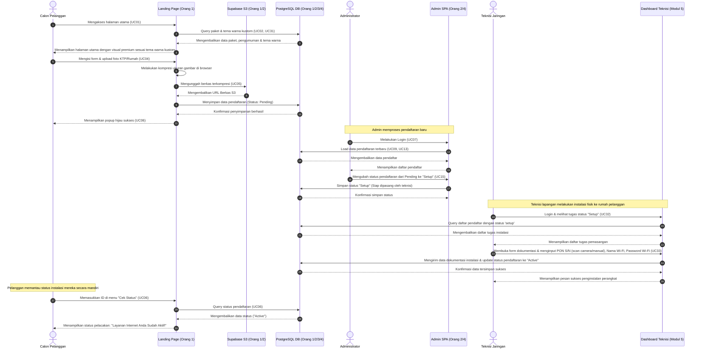

# Dokumentasi Fitur & Spesifikasi Use Case R-NET

Dokumen ini menjelaskan secara menyeluruh seluruh fitur dan fungsionalitas sistem **R-NET (Sistem Pendaftaran Internet Provider)**. Penjelasan dibagi berdasarkan modul fungsional pengembang, mencakup **32 Use Cases (UC01 - UC33)** (dikurangi beberapa cadangan) yang didesain untuk sistem ini, beserta alur kerja (workflow) terintegrasi antar-modul.

---

## Daftar Isi
1. [Peta Fungsionalitas & Use Cases](#peta-fungsionalitas--use-cases)
2. [Modul 1: Portal Pelanggan & Front-End (Orang 1)](#modul-1-portal-pelanggan--front-end-orang-1)
3. [Modul 2: Manajemen Pendaftaran & Auth (Orang 2)](#modul-2-manajemen-pendaftaran--auth-orang-2)
4. [Modul 3: Konten Produk & Promosi (Orang 3)](#modul-3-konten-produk--promosi-orang-3)
5. [Modul 4: Monitoring Sistem & Pengumuman (Orang 4)](#modul-4-monitoring-sistem--pengumuman-orang-4)
6. [Modul 5: Portal & Dashboard Teknisi (Kolaboratif)](#modul-5-portal--dashboard-teknisi-kolaboratif)
7. [Alur Kerja Terintegrasi (Integration Workflows)](#alur-kerja-terintegrasi-integration-workflows)

---

## Peta Fungsionalitas & Use Cases

Sistem R-NET dirancang memiliki tiga aktor utama:
1.  **Calon Pelanggan / Pengguna Umum**: Mengakses portal publik untuk melihat penawaran, panduan pemasangan, mengirim umpan balik, dan mendaftar layanan.
2.  **Admin (Administrator / Developer)**: Mengakses area administrasi yang dilindungi keamanan untuk memantau sistem, memvalidasi pendaftar, mengelola peran (role), kustomisasi tema, dan mengelola konten produk/pengumuman.
3.  **Teknisi (Technician)**: Mengakses portal khusus teknisi untuk melihat tugas instalasi dan mengunggah dokumentasi fisik pemasangan perangkat.

```mermaid
graph TD
    subgraph Portal Pelanggan
        UC01[UC01: Melihat Halaman Utama]
        UC02[UC02: Melihat Informasi Paket]
        UC03[UC03: Melihat Pengumuman Aktif]
        UC04[UC04: Mengisi Formulir Pendaftaran]
        UC05[UC05: Mengunggah Berkas Identitas]
        UC06[UC06: Melihat Status Pendaftaran]
        UC26[UC26: Melihat Detail Panduan Pemasangan]
        UC27[UC27: Mengirim Umpan Balik via WA]
        
        UC04 -->|Include| UC05
        UC04 -->|Extend| UC06
    end

    subgraph Admin Panel SPA
        UC07[UC07: Melakukan Login]
        UC08[UC08: Melakukan Logout]
        
        subgraph Modul Pendaftaran & Peran
            UC13[UC13: Melihat Daftar Pendaftar]
            UC14[UC14: Melihat Detail Pendaftar]
            UC15[UC15: Mengubah Status Pendaftaran]
            UC16[UC16: Menghapus Data Pendaftar]
            UC28[UC28: Manajemen Akun & Peran]
            UC29[UC29: Menghubungi Pelanggan via WA Direct]
        end

        subgraph Modul Paket & Promosi
            UC17[UC17: Menambahkan Paket Baru]
            UC18[UC18: Mengubah Data Paket]
            UC19[UC19: Menghapus Data Paket]
            UC23[UC23: Menambahkan Promosi]
            UC24[UC24: Mengubah Promosi]
            UC25[UC25: Menghapus Promosi]
            UC30[UC30: Mengatur Label Tombol Beli Paket]
        end

        subgraph Modul Monitoring, Pengumuman & Tema
            UC09[UC09: Melihat Dashboard Utama]
            UC11[UC11: Melihat Monitoring Server]
            UC12[UC12: Melihat Monitoring DB & S3]
            UC20[UC20: Menambahkan Pengumuman]
            UC21[UC21: Mengubah Pengumuman]
            UC22[UC22: Menghapus Pengumuman]
            UC31[UC31: Mengubah Tema Landing Page & Panduan Pasang]
        end
    end

    subgraph Portal Teknisi
        UC32[UC32: Mengakses Dashboard Teknisi]
        UC33[UC33: Mengisi Dokumentasi Penginstalan]
    end

    CalonPelanggan((Calon Pelanggan)) --> PortalPelanggan
    Admin((Administrator)) --> AdminPanelSPA
    Teknisi((Teknisi)) --> PortalTeknisi
```
---

## Modul 1: Portal Pelanggan & Front-End (Orang 1)

Modul ini menyediakan portal pelanggan interaktif berbasis web untuk memuat promosi, pengumuman, dan pendaftaran online.

### UC01: Melihat Halaman Utama
*   **Tujuan Fitur**: Mengakses dan memuat landing page sistem R-NET.
*   **Aktor**: Calon Pelanggan
*   **Alur Fitur**:
    `User memasukkan URL R-NET -> Sistem memvalidasi -> Menampilkan Landing Page`
*   **Route / Controller Terkait**:
    `GET /` (Route Closure di `routes/web.php` rendering view `welcome`)
*   **Screenshot Fitur**:
    

### UC02: Melihat Informasi Paket
*   **Tujuan Fitur**: Membaca kecepatan, harga, dan diskon paket internet yang ditawarkan.
*   **Aktor**: Calon Pelanggan
*   **Alur Fitur**:
    `User scroll ke bagian Paket -> Sistem memuat paket dari DB -> Merender kartu paket`
*   **Route / Controller Terkait**:
    `GET /` (Route Closure di `routes/web.php` dengan query eager loading `paket::with('promosi')`)
*   **Screenshot Fitur**:
    

### UC03: Melihat Pengumuman Aktif
*   **Tujuan Fitur**: Mengetahui pengumuman penting/berita maintenance di bagian atas portal.
*   **Aktor**: Calon Pelanggan
*   **Alur Fitur**:
    `User membuka landing page -> Sistem memuat pengumuman aktif hari ini -> Menampilkan banner melayang`
*   **Route / Controller Terkait**:
    `GET /` (Route Closure di `routes/web.php` memfilter model `pengumuman`)
*   **Screenshot Fitur**:
    

### UC04: Mengisi Formulir Pendaftaran
*   **Tujuan Fitur**: Mendaftarkan identitas diri dan melampirkan berkas fisik untuk berlangganan.
*   **Aktor**: Calon Pelanggan
*   **Alur Fitur**:
    `User klik Daftar -> Mengisi Form & Peta Koordinat -> Klik Kirim -> Menyimpan ke DB`
*   **Route / Controller Terkait**:
    `GET /daftar` (Menampilkan form pendaftaran) dan `POST /daftar` (Menyimpan data pendaftar baru)
*   **Screenshot Fitur**:
    

### UC05: Mengunggah Berkas Identitas
*   **Tujuan Fitur**: Melampirkan foto bukti fisik pendaftaran secara cloud ke Supabase S3.
*   **Aktor**: Calon Pelanggan
*   **Alur Fitur**:
    `User upload berkas -> Browser kompresi gambar -> Sistem mengunggah berkas ke Supabase S3 -> Menyimpan URL di DB`
*   **Route / Controller Terkait**:
    `POST /daftar` (Logic penyimpanan file `Storage::disk('s3')->storeAs('pendaftaran', $fileName, 's3')`)
*   **Screenshot Fitur**:
    

### UC06: Melihat Status Pendaftaran
*   **Tujuan Fitur**: Melacak status verifikasi pendaftaran menggunakan ID unik secara mandiri.
*   **Aktor**: Calon Pelanggan
*   **Alur Fitur**:
    `User memasukkan ID Pendaftaran -> Sistem mencocokkan -> Merender visual stepper status`
*   **Route / Controller Terkait**:
    `GET /cek-status` (Render tracker page) dan `GET /cek-status/{id}` (JSON API untuk detail status)
*   **Screenshot Fitur**:
    

### UC26: Melihat Detail Panduan Pemasangan
*   **Tujuan Fitur**: Membaca panduan langkah-langkah pemasangan modem dan kabel.
*   **Aktor**: Calon Pelanggan / Pengguna Umum
*   **Alur Fitur**:
    `User membuka petunjuk panduan -> Sistem memuat teks dan instruksi visual dari DB -> Menampilkan di layout`
*   **Route / Controller Terkait**:
    `GET /` (Route Closure memuat `CompanySetting` untuk teks panduan)
*   **Screenshot Fitur**:
    

### UC27: Mengirim Umpan Balik via WA
*   **Tujuan Fitur**: Menghubungi customer service/admin R-NET langsung via tautan WhatsApp.
*   **Aktor**: Calon Pelanggan / Pengguna Umum
*   **Alur Fitur**:
    `User klik tombol WA mengambang -> Membuka tab baru wa.me dengan pesan template kustom`
*   **Route / Controller Terkait**:
    Client-side redirection ke external link `https://wa.me/{nomor_admin}`
*   **Screenshot Fitur**:
    

---

## Modul 2: Manajemen Pendaftaran & Auth (Orang 2)

Modul ini memfasilitasi admin untuk login secara aman, meninjau pendaftar baru, melihat data fisik foto rumah/KTP dari cloud, mengubah status pendaftar, dan menghapus pendaftaran tidak valid.

### UC07: Melakukan Login
*   **Tujuan Fitur**: Memverifikasi kredensial admin agar dapat mengelola dasbor sistem.
*   **Aktor**: Admin
*   **Alur Fitur**:
    `Admin memasukkan Email & Password -> Sistem mencocokkan hash -> Membuat session -> Dialihkan ke /admin`
*   **Route / Controller Terkait**:
    `GET /login` (Render form login) dan `POST /login` (Proses login menggunakan `Auth::attempt()`)
*   **Screenshot Fitur**:
    

### UC08: Melakukan Logout
*   **Tujuan Fitur**: Menghancurkan session login untuk mencegah akses ilegal.
*   **Aktor**: Admin
*   **Alur Fitur**:
    `Admin klik Logout -> Sistem menghancurkan session aktif -> Dialihkan kembali ke /login`
*   **Route / Controller Terkait**:
    `POST /logout` (Menggunakan `Auth::logout()` dan `session()->invalidate()`)
*   **Screenshot Fitur**:
    

### UC13: Melihat Daftar Pendaftar
*   **Tujuan Fitur**: Melihat data tabel kolektif dari seluruh calon pelanggan yang sudah mendaftar.
*   **Aktor**: Admin
*   **Alur Fitur**:
    `Admin klik menu Pendaftaran -> JS toggle display panel -> Merender tabel data pendaftaran`
*   **Route / Controller Terkait**:
    `GET /admin` (Route Closure memuat view `admin.index` dengan data `$pendaftaran` eager-loaded)
*   **Screenshot Fitur**:
    

### UC14: Melihat Detail Pendaftar
*   **Tujuan Fitur**: Memeriksa detail alamat, nomor HP, foto rumah dari cloud storage, dan peta geografis Leaflet.js.
*   **Aktor**: Admin
*   **Alur Fitur**:
    `Admin klik Detail -> Membuka modal popup -> Mengambil URL berkas dari S3 -> Memulai Leaflet peta koordinat`
*   **Route / Controller Terkait**:
    Dipicu oleh frontend JS event handler pada tab Pendaftaran di view `admin.index`
*   **Screenshot Fitur**:
    

### UC15: Mengubah Status Pendaftaran
*   **Tujuan Fitur**: Memvalidasi status berlangganan pendaftar (Pending, Validated, Rejected, Setup, Active).
*   **Aktor**: Admin
*   **Alur Fitur**:
    `Admin ubah status dropdown -> JavaScript mengirim PATCH request -> Database diupdate -> Badge berubah`
*   **Route / Controller Terkait**:
    `PATCH /admin/pendaftaran/{id}/status` (Route Closure mengupdate status kolom `status`)
*   **Screenshot Fitur**:
    

### UC16: Menghapus Data Pendaftar
*   **Tujuan Fitur**: Membersihkan data sampah atau pendaftar fiktif dari database.
*   **Aktor**: Admin
*   **Alur Fitur**:
    `Admin klik Hapus -> Konfirmasi dialog -> Server menghapus berkas di Supabase S3 -> Server menghapus record di DB -> Baris tabel di-remove`
*   **Route / Controller Terkait**:
    `DELETE /admin/pendaftaran/{id}` (Route Closure menghapus berkas S3 dan record di database)
*   **Screenshot Fitur**:
    

### UC28: Manajemen Akun & Peran (Role Management)
*   **Tujuan Fitur**: Mengelola profil admin dan mengedit preferensi akun serta kredensial masuk.
*   **Aktor**: Admin
*   **Alur Fitur**:
    `Admin membuka modul profil -> Mengisi username/email baru -> Klik simpan -> Data profil diperbarui`
*   **Route / Controller Terkait**:
    `PUT /admin/profil` (Pembaruan data profil admin) dan `POST /admin/profil/avatar` (Pembaruan foto avatar)
*   **Screenshot Fitur**:
    

### UC29: Menghubungi Pelanggan via WhatsApp Direct Link
*   **Tujuan Fitur**: Menghubungi pelanggan secara cepat menggunakan interaksi tautan WA langsung.
*   **Aktor**: Admin
*   **Alur Fitur**:
    `Admin mengklik ikon WA di baris pendaftaran -> Membuka chat WhatsApp langsung menuju nomor tujuan`
*   **Route / Controller Terkait**:
    Tautan eksternal dynamic helper `https://wa.me/{nomor_tlpn}` pada view partial `admin/partials/pendaftaran.blade.php`
*   **Screenshot Fitur**:
    

---

## Modul 3: Konten Produk & Promosi (Orang 3)

Modul ini mengelola data paket internet dan promosi aktif untuk disajikan secara dinamis kepada calon pelanggan.

### UC17: Menambahkan Paket Baru
*   **Tujuan Fitur**: Memasukkan produk paket internet baru ke dalam sistem.
*   **Aktor**: Admin
*   **Alur Fitur**:
    `Admin klik Tambah Paket -> Mengisi Data Form -> Simpan -> Masuk ke database`
*   **Route / Controller Terkait**:
    `POST /admin/paket` (Route Closure menyimpan record baru ke tabel `pakets`)
*   **Screenshot Fitur**:
    

### UC18: Mengubah Data Paket
*   **Tujuan Fitur**: Memperbarui harga, kecepatan, deskripsi, atau template tema kartu paket internet.
*   **Aktor**: Admin
*   **Alur Fitur**:
    `Admin klik Edit Paket -> Form termuat dengan data lama -> Mengedit data -> Simpan`
*   **Route / Controller Terkait**:
    `PUT /admin/paket/{id}` (Route Closure memperbarui data paket berdasarkan ID)
*   **Screenshot Fitur**:
    

### UC19: Menghapus Data Paket
*   **Tujuan Fitur**: Menghapus paket layanan yang sudah tidak ditawarkan dari database.
*   **Aktor**: Admin
*   **Alur Fitur**:
    `Admin klik Hapus -> Konfirmasi dialog -> Record dihapus dari DB -> Kartu ditarik dari landing page`
*   **Route / Controller Terkait**:
    `DELETE /admin/paket/{id}` (Route Closure menghapus record paket di database)
*   **Screenshot Fitur**:
    

### UC23: Menambahkan Promosi
*   **Tujuan Fitur**: Menambahkan program promosi/diskon baru pada paket internet.
*   **Aktor**: Admin
*   **Alur Fitur**:
    `Admin klik Tambah Promosi -> Mengisi data promo -> Simpan -> Record promo dibuat`
*   **Route / Controller Terkait**:
    `POST /admin/promosi` (Route Closure menyimpan promosi baru ke tabel `promosis`)
*   **Screenshot Fitur**:
    

### UC24: Mengubah Promosi
*   **Tujuan Fitur**: Mengubah nominal diskon, kode promo, deskripsi, atau masa aktif promosi.
*   **Aktor**: Admin
*   **Alur Fitur**:
    `Admin klik Edit -> Memperbarui tanggal kadaluwarsa/nilai diskon -> Simpan -> Database diupdate`
*   **Route / Controller Terkait**:
    `PUT /admin/promosi/{id}` (Route Closure mengupdate data promosi di database)
*   **Screenshot Fitur**:
    

### UC25: Menghapus Promosi
*   **Tujuan Fitur**: Menghapus program diskon/promosi dari database.
*   **Aktor**: Admin
*   **Alur Fitur**:
    `Admin klik Hapus -> Konfirmasi dialog -> Record dihapus -> Relasi paket terkait di-set ke null`
*   **Route / Controller Terkait**:
    `DELETE /admin/promosi/{id}` (Route Closure menghapus record promosi)
*   **Screenshot Fitur**:
    

### UC30: Mengatur Label Tombol Beli Paket
*   **Tujuan Fitur**: Mengatur teks tombol CTA (Call to Action) kustom per paket internet.
*   **Aktor**: Admin
*   **Alur Fitur**:
    `Admin mengisi field label CTA di form kustomisasi paket -> Simpan -> Dirender dinamis di Landing Page`
*   **Route / Controller Terkait**:
    `POST /admin/paket` dan `PUT /admin/paket/{id}` (Menyimpan field `badge_text` / CTA label ke database)
*   **Screenshot Fitur**:
    

---

## Modul 4: Monitoring Sistem & Pengumuman (Orang 4)

Modul ini bertanggung jawab memantau kesehatan server, database PostgreSQL, kapasitas S3, visualisasi Chart.js, dan pengelolaan pengumuman.

### UC09: Melihat Dashboard Utama
*   **Tujuan Fitur**: Membaca agregasi data dan grafik tren pendaftaran pendaftar 7 hari terakhir.
*   **Aktor**: Admin / Developer
*   **Alur Fitur**:
    `Admin membuka /admin -> Sistem mengkueri total statistik -> Merender halaman -> Chart.js menggambar grafik`
*   **Route / Controller Terkait**:
    `GET /admin` (Route Closure memproses aggregate counts dan parsing data ke dashboard view)
*   **Screenshot Fitur**:
    

### UC11: Melihat Monitoring Server
*   **Tujuan Fitur**: Memantau performa resource server (penggunaan memori, load time, PHP version).
*   **Aktor**: Admin / Developer
*   **Alur Fitur**:
    `Admin membuka Dashboard -> Sistem kalkulasi status memory & load time -> Menampilkan data`
*   **Route / Controller Terkait**:
    `GET /admin` (Mengakses endpoint internal untuk membaca resources server)
*   **Screenshot Fitur**:
    

### UC12: Melihat Monitoring DB & S3
*   **Tujuan Fitur**: Mengecek status ketersediaan koneksi database PostgreSQL dan Cloud Storage Supabase S3.
*   **Aktor**: Admin / Developer
*   **Alur Fitur**:
    `Admin membuka Dashboard -> Sistem mengirim ping ke Supabase DB & S3 bucket -> Menampilkan indikator koneksi`
*   **Route / Controller Terkait**:
    `GET /admin` (Melakukan query DB dan pengecekan driver disk S3)
*   **Screenshot Fitur**:
    

### UC20: Menambahkan Pengumuman
*   **Tujuan Fitur**: Membuat papan pengumuman/informasi gangguan untuk disajikan di landing page pelanggan.
*   **Aktor**: Admin
*   **Alur Fitur**:
    `Admin klik Buat Pengumuman -> Mengisi teks pengumuman & masa berlaku -> Simpan`
*   **Route / Controller Terkait**:
    `POST /admin/pengumuman` (Route Closure menyimpan pengumuman baru ke tabel `pengumumans`)
*   **Screenshot Fitur**:
    

### UC21: Mengubah Pengumuman
*   **Tujuan Fitur**: Memperbaiki teks atau masa berlaku pengumuman yang aktif.
*   **Aktor**: Admin
*   **Alur Fitur**:
    `Admin klik Edit -> Mengupdate teks/tanggal -> Simpan -> Data ter-update`
*   **Route / Controller Terkait**:
    `PUT /admin/pengumuman/{id}` (Route Closure memperbarui data pengumuman)
*   **Screenshot Fitur**:
    

### UC22: Menghapus Pengumuman
*   **Tujuan Fitur**: Mencabut pengumuman yang sudah selesai dari database.
*   **Aktor**: Admin
*   **Alur Fitur**:
    `Admin klik Hapus -> Konfirmasi -> Record didelete dari DB -> Banner di landing page hilang`
*   **Route / Controller Terkait**:
    `DELETE /admin/pengumuman/{id}` (Route Closure menghapus data pengumuman)
*   **Screenshot Fitur**:
    

### UC31: Mengubah Tema Warna Landing Page & Panduan Pasang
*   **Tujuan Fitur**: Mengubah tema warna (warna latar, tombol, border) kartu paket di landing page.
*   **Aktor**: Admin
*   **Alur Fitur**:
    `Admin ubah color picker -> JS merender preview langsung -> Simpan -> Tema warna diterapkan di landing page`
*   **Route / Controller Terkait**:
    `PUT /admin/paket/{id}` (Mengupdate kolom tema kustom pada tabel `pakets`)
*   **Screenshot Fitur**:
    

---

## Modul 5: Portal & Dashboard Teknisi (Kolaboratif)

Modul ini menyediakan akses portal mandiri bagi kru lapangan/teknisi R-NET untuk melihat jadwal pekerjaan instalasi yang ditugaskan kepada mereka dan mendokumentasikan hasil pemasangan fisik di lokasi pelanggan.

### UC32: Mengakses Dashboard Teknisi
*   **Tujuan Fitur**: Membuka dashboard tugas instalasi.
*   **Aktor**: Teknisi
*   **Alur Fitur**:
    `Teknisi login -> Sistem validasi role = teknisi -> Menampilkan daftar tugas status Setup`
*   **Route / Controller Terkait**:
    `GET /technician/dashboard` (Fitur Terencana - diakses via middleware multi-role auth)
*   **Screenshot Fitur**:
    

### UC33: Mengisi Formulir Dokumentasi Penginstalan
*   **Tujuan Fitur**: Mengunggah PON S/N, nama Wi-Fi, dan password Wi-Fi dari modem pelanggan.
*   **Aktor**: Teknisi
*   **Alur Fitur**:
    `Teknisi input data fisik (manual / scan camera) -> Simpan -> Status pendaftaran ter-update ke Active`
*   **Route / Controller Terkait**:
    `POST /technician/installation` (Fitur Terencana - diakses via teknisi role)
*   **Screenshot Fitur**:
    

---

## 🔄 Alur Kerja Terintegrasi (Integration Workflows)

Untuk mempermudah pemahaman bagaimana seluruh modul bekerja sama, berikut disajikan skenario interaksi sistem (End-to-End Workflow) dari proses pendaftaran, penugasan teknisi, hingga pemasangan selesai.

### Skenario: Alur Pendaftaran Hingga Pemasangan Selesai oleh Teknisi



---
*Dokumentasi Fitur PBL R-NET — 2026*
